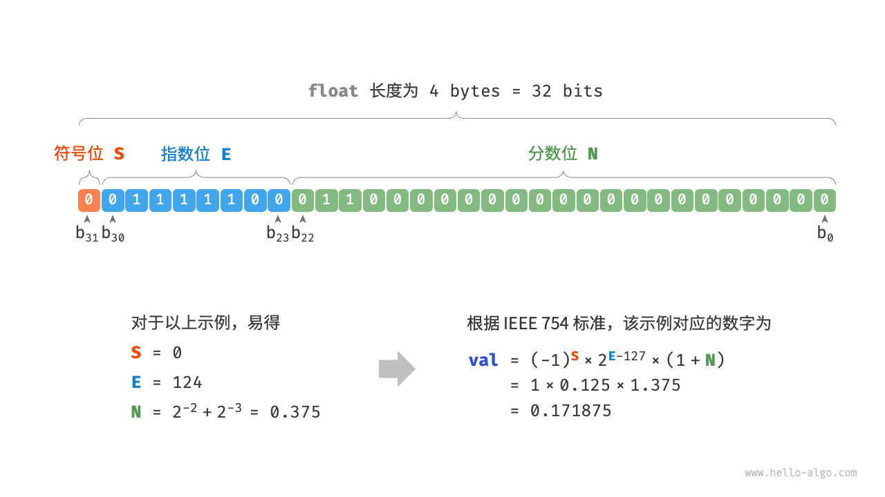
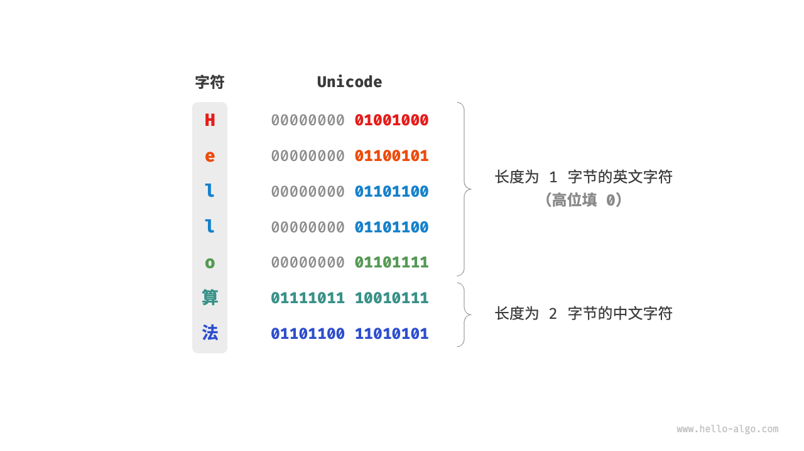
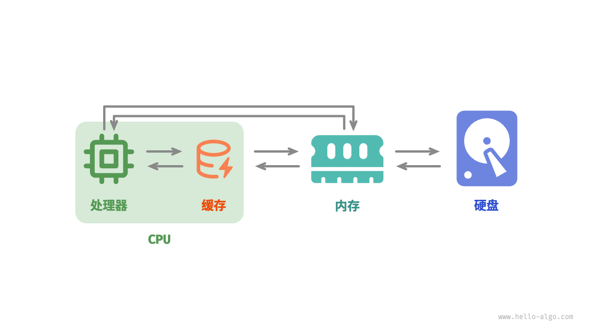

# Hello 算法

## 第1章 数据结构

### 1.1数据结构分类

> **逻辑结构：线性与非线性**

- **线性数据结构**：数组，链表，栈，队列，哈希表，元素之间是一对一的关系
- **非线性数据结构：**树，堆，图，哈希表

**所有数据结构都是基于数组，链表或者二者的结合实现的。**

- **基于数组可实现：**栈，队列，哈希表，树，堆，图，矩阵，张量（维度≥3的数组）等
- **基于链表可实现：**栈，队列，哈希表，树，堆，图等。

非线性数据结构又可进一步划分为：

- **树形结构：**树，堆，哈希表，元素之间是一对多的关系
- **网状结构：**图，元素之间是多对多的关系
  

> **物理结构：连续与分散**

### 1.2 数字编码

> **1.2.1 原码、反码和补码**

**数字是以补码的形式存储在计算机中的。**

- **原码**：我们将数字的二进制表示的最高位视为符号位，其中 0 表示正数，1 表示负数，其余位表示数字的值。
- **反码**：正数的反码与其原码相同，负数的反码是对其原码除符号位外的所有位取反。
- **补码**：正数的补码与其原码相同，负数的补码是在其反码的基础上加 1 。
  

**计算机内部的硬件电路主要是基于加法运算设计的。**

> **浮点数编码**

细心的你可能会发现：`int` 和 `float` 长度相同，都是 4 字节 ，但为什么 `float` 的取值范围远大于 `int` ？这非常反直觉，因为按理说 `float` 需要表示小数，取值范围应该变小才对。

实际上，**这是因为浮点数 `float` 采用了不同的表示方式**。记一个 32 比特长度的二进制数为：

根据 IEEE 754 标准，32-bit 长度的 `float` 由以下三个部分构成。

- 符号位 S ：占 1 位 ，对应 b~31~.
- 指数位 E ：占 8 位 ，对应  b30b29...b23。
- 分数位 N ：占 23 位 ，对应 b~22~ b~21~...b~0~。

二进制数 `float` 对应值的计算方法为：

转化到十进制下的计算公式为：

其中各项的取值范围为：

图 3-5  IEEE 754 标准下的 float 的计算示例

现在我们可以回答最初的问题：**`float` 的表示方式包含指数位，导致其取值范围远大于 `int`** 。根据以上计算，`float` 可表示的最大正数为 ，切换符号位便可得到最小负数。

**尽管浮点数 `float` 扩展了取值范围，但其副作用是牺牲了精度**。整数类型 `int` 将全部 32 比特用于表示数字，数字是均匀分布的；而由于指数位的存在，浮点数 `float` 的数值越大，相邻两个数字之间的差值就会趋向越大。

如表 3-2 所示，指数位 E=0 和 E=255 具有特殊含义，**用于表示零、无穷大、NaN 等**。

表 3-2  指数位含义

| 指数位 E  | 分数位 N=0 | 分数位 N≠0 | 计算公式                 |
| :-------- | :--------- | :--------- | :----------------------- |
| 0         | ±0         | 次正规数   | (−1)^S^×2^−126^×(0.N)    |
| 1,2,…,254 | 正规数     | 正规数     | (−1)^S^×2^(E−127)^×(1.N) |
| 255       | ±∞         | NaN        |                          |

值得说明的是，次正规数显著提升了浮点数的精度。最小正正规数为 2^−126^ ，最小正次正规数为 2^−126^×2^−23^ 。

双精度 `double` 也采用类似于 `float` 的表示方法，在此不做赘述。

### 1.3 字符编码

在计算机中，所有数据都是以二进制数的形式存储的，字符 `char` 也不例外。为了表示字符，我们需要建立一套“字符集”，规定每个字符和二进制数之间的一一对应关系。有了字符集之后，计算机就可以通过查表完成二进制数到字符的转换。

>  **1.3.1 ASCII 字符集**

ASCII 码是最早出现的字符集，其全称为 American Standard Code for Information Interchange（美国标准信息交换代码）。它使用 7 位二进制数（一个字节的低 7 位）表示一个字符，最多能够表示 128 个不同的字符。如图 3-6 所示，ASCII 码包括英文字母的大小写、数字 0 ~ 9、一些标点符号，以及一些控制字符（如换行符和制表符）。

图 3-6  ASCII 码

然而，**ASCII 码仅能够表示英文**。随着计算机的全球化，诞生了一种能够表示更多语言的 EASCII 字符集。它在 ASCII 的 7 位基础上扩展到 8 位，能够表示 256 个不同的字符。

在世界范围内，陆续出现了一批适用于不同地区的 EASCII 字符集。这些字符集的前 128 个字符统一为 ASCII 码，后 128 个字符定义不同，以适应不同语言的需求。

> **1.3.2  GBK 字符集**

后来人们发现，**EASCII 码仍然无法满足许多语言的字符数量要求**。比如汉字有近十万个，光日常使用的就有几千个。中国国家标准总局于 1980 年发布了 GB2312 字符集，其收录了 6763 个汉字，基本满足了汉字的计算机处理需要。

然而，GB2312 无法处理部分罕见字和繁体字。GBK 字符集是在 GB2312 的基础上扩展得到的，它共收录了 21886 个汉字。在 GBK 的编码方案中，ASCII 字符使用一个字节表示，汉字使用两个字节表示。

> **1.3.3  Unicode 字符集**

随着计算机技术的蓬勃发展，字符集与编码标准百花齐放，而这带来了许多问题。一方面，这些字符集一般只定义了特定语言的字符，无法在多语言环境下正常工作。另一方面，同一种语言存在多种字符集标准，如果两台计算机使用的是不同的编码标准，则在信息传递时就会出现乱码。

那个时代的研究人员就在想：**如果推出一个足够完整的字符集，将世界范围内的所有语言和符号都收录其中，不就可以解决跨语言环境和乱码问题了吗**？在这种想法的驱动下，一个大而全的字符集 Unicode 应运而生。

Unicode 的中文名称为“统一码”，理论上能容纳 100 多万个字符。它致力于将全球范围内的字符纳入统一的字符集之中，提供一种通用的字符集来处理和显示各种语言文字，减少因为编码标准不同而产生的乱码问题。

自 1991 年发布以来，Unicode 不断扩充新的语言与字符。截至 2022 年 9 月，Unicode 已经包含 149186 个字符，包括各种语言的字符、符号甚至表情符号等。在庞大的 Unicode 字符集中，常用的字符占用 2 字节，有些生僻的字符占用 3 字节甚至 4 字节。

Unicode 是一种通用字符集，本质上是给每个字符分配一个编号（称为“码点”），**但它并没有规定在计算机中如何存储这些字符码点**。我们不禁会问：当多种长度的 Unicode 码点同时出现在一个文本中时，系统如何解析字符？例如给定一个长度为 2 字节的编码，系统如何确认它是一个 2 字节的字符还是两个 1 字节的字符？

对于以上问题，**一种直接的解决方案是将所有字符存储为等长的编码**。如图 3-7 所示，“Hello”中的每个字符占用 1 字节，“算法”中的每个字符占用 2 字节。我们可以通过高位填 0 将“Hello 算法”中的所有字符都编码为 2 字节长度。这样系统就可以每隔 2 字节解析一个字符，恢复这个短语的内容了。

图 3-7  Unicode 编码示例

然而 ASCII 码已经向我们证明，编码英文只需 1 字节。若采用上述方案，英文文本占用空间的大小将会是 ASCII 编码下的两倍，非常浪费内存空间。因此，我们需要一种更加高效的 Unicode 编码方法。

> **1.3.4  UTF-8 编码**

目前，UTF-8 已成为国际上使用最广泛的 Unicode 编码方法。**它是一种可变长度的编码**，使用 1 到 4 字节来表示一个字符，根据字符的复杂性而变。ASCII 字符只需 1 字节，拉丁字母和希腊字母需要 2 字节，常用的中文字符需要 3 字节，其他的一些生僻字符需要 4 字节。

UTF-8 的编码规则并不复杂，分为以下两种情况。

- 对于长度为 1 字节的字符，将最高位设置为 0 ，其余 7 位设置为 Unicode 码点。值得注意的是，ASCII 字符在 Unicode 字符集中占据了前 128 个码点。也就是说，**UTF-8 编码可以向下兼容 ASCII 码**。这意味着我们可以使用 UTF-8 来解析年代久远的 ASCII 码文本。
- 对于长度为 n 字节的字符（其中 n>1），将首个字节的高 n 位都设置为 1 ，第 n+1 位设置为 0 ；从第二个字节开始，将每个字节的高 2 位都设置为 10 ；其余所有位用于填充字符的 Unicode 码点。

图 3-8 展示了“Hello算法”对应的 UTF-8 编码。观察发现，由于最高 n 位都设置为 1 ，因此系统可以通过读取最高位 1 的个数来解析出字符的长度为 n 。

但为什么要将其余所有字节的高 2 位都设置为 10 呢？实际上，这个 10 能够起到校验符的作用。假设系统从一个错误的字节开始解析文本，字节头部的 10 能够帮助系统快速判断出异常。

之所以将 10 当作校验符，是因为在 UTF-8 编码规则下，不可能有字符的最高两位是 10 。这个结论可以用反证法来证明：假设一个字符的最高两位是 10 ，说明该字符的长度为 1 ，对应 ASCII 码。而 ASCII 码的最高位应该是 0 ，与假设矛盾。

图 3-8  UTF-8 编码示例

除了 UTF-8 之外，常见的编码方式还包括以下两种。

- **UTF-16 编码**：使用 2 或 4 字节来表示一个字符。所有的 ASCII 字符和常用的非英文字符，都用 2 字节表示；少数字符需要用到 4 字节表示。对于 2 字节的字符，UTF-16 编码与 Unicode 码点相等。
- **UTF-32 编码**：每个字符都使用 4 字节。这意味着 UTF-32 比 UTF-8 和 UTF-16 更占用空间，特别是对于 ASCII 字符占比较高的文本。

从存储空间占用的角度看，使用 UTF-8 表示英文字符非常高效，因为它仅需 1 字节；使用 UTF-16 编码某些非英文字符（例如中文）会更加高效，因为它仅需 2 字节，而 UTF-8 可能需要 3 字节。

从兼容性的角度看，UTF-8 的通用性最佳，许多工具和库优先支持 UTF-8 。

> **1.3.5  编程语言的字符编码**

对于以往的大多数编程语言，程序运行中的字符串都采用 UTF-16 或 UTF-32 这类等长编码。在等长编码下，我们可以将字符串看作数组来处理，这种做法具有以下优点。

- **随机访问**：UTF-16 编码的字符串可以很容易地进行随机访问。UTF-8 是一种变长编码，要想找到第 i 个字符，我们需要从字符串的开始处遍历到第 i 个字符，这需要 O(n) 的时间。
- **字符计数**：与随机访问类似，计算 UTF-16 编码的字符串的长度也是 O(1) 的操作。但是，计算 UTF-8 编码的字符串的长度需要遍历整个字符串。
- **字符串操作**：在 UTF-16 编码的字符串上，很多字符串操作（如分割、连接、插入、删除等）更容易进行。在 UTF-8 编码的字符串上，进行这些操作通常需要额外的计算，以确保不会产生无效的 UTF-8 编码。

实际上，编程语言的字符编码方案设计是一个很有趣的话题，涉及许多因素。

- Java 的 `String` 类型使用 UTF-16 编码，每个字符占用 2 字节。这是因为 Java 语言设计之初，人们认为 16 位足以表示所有可能的字符。然而，这是一个不正确的判断。后来 Unicode 规范扩展到了超过 16 位，所以 Java 中的字符现在可能由一对 16 位的值（称为“代理对”）表示。
- JavaScript 和 TypeScript 的字符串使用 UTF-16 编码的原因与 Java 类似。当 1995 年 Netscape 公司首次推出 JavaScript 语言时，Unicode 还处于发展早期，那时候使用 16 位的编码就足以表示所有的 Unicode 字符了。
- C# 使用 UTF-16 编码，主要是因为 .NET 平台是由 Microsoft 设计的，而 Microsoft 的很多技术（包括 Windows 操作系统）都广泛使用 UTF-16 编码。

由于以上编程语言对字符数量的低估，它们不得不采取“代理对”的方式来表示超过 16 位长度的 Unicode 字符。这是一个不得已为之的无奈之举。一方面，包含代理对的字符串中，一个字符可能占用 2 字节或 4 字节，从而丧失了等长编码的优势。另一方面，处理代理对需要额外增加代码，这提高了编程的复杂性和调试难度。

出于以上原因，部分编程语言提出了一些不同的编码方案。

- Python 中的 `str` 使用 Unicode 编码，并采用一种灵活的字符串表示，存储的字符长度取决于字符串中最大的 Unicode 码点。若字符串中全部是 ASCII 字符，则每个字符占用 1 字节；如果有字符超出了 ASCII 范围，但全部在基本多语言平面（BMP）内，则每个字符占用 2 字节；如果有超出 BMP 的字符，则每个字符占用 4 字节。
- Go 语言的 `string` 类型在内部使用 UTF-8 编码。Go 语言还提供了 `rune` 类型，它用于表示单个 Unicode 码点。
- Rust 语言的 `str` 和 `String` 类型在内部使用 UTF-8 编码。Rust 也提供了 `char` 类型，用于表示单个 Unicode 码点。

需要注意的是，以上讨论的都是字符串在编程语言中的存储方式，**这和字符串如何在文件中存储或在网络中传输是不同的问题**。在文件存储或网络传输中，我们通常会将字符串编码为 UTF-8 格式，以达到最优的兼容性和空间效率。

###  1.4Q&A

**Q**：为什么哈希表同时包含线性数据结构和非线性数据结构？

哈希表底层是数组，而为了解决哈希冲突，我们可能会使用“链式地址”（后续“哈希冲突”章节会讲）：数组中每个桶指向一个链表，当链表长度超过一定阈值时，又可能被转化为树（通常为红黑树）。

从存储的角度来看，哈希表的底层是数组，其中每一个桶槽位可能包含一个值，也可能包含一个链表或一棵树。因此，哈希表可能同时包含线性数据结构（数组、链表）和非线性数据结构（树）。

**Q**：`char` 类型的长度是 1 字节吗？

`char` 类型的长度由编程语言采用的编码方法决定。例如，Java、JavaScript、TypeScript、C# 都采用 UTF-16 编码（保存 Unicode 码点），因此 `char` 类型的长度为 2 字节。

**Q**：基于数组实现的数据结构也称“静态数据结构” 是否有歧义？栈也可以进行出栈和入栈等操作，这些操作都是“动态”的。

栈确实可以实现动态的数据操作，但数据结构仍然是“静态”（长度不可变）的。尽管基于数组的数据结构可以动态地添加或删除元素，但它们的容量是固定的。如果数据量超出了预分配的大小，就需要创建一个新的更大的数组，并将旧数组的内容复制到新数组中。

**Q**：在构建栈（队列）的时候，未指定它的大小，为什么它们是“静态数据结构”呢？

在高级编程语言中，我们无须人工指定栈（队列）的初始容量，这个工作由类内部自动完成。例如，Java 的 `ArrayList` 的初始容量通常为 10。另外，扩容操作也是自动实现的。详见后续的“列表”章节。

**Q**：原码转补码的方法是“先取反后加 1”，那么补码转原码应该是逆运算“先减 1 后取反”，而补码转原码也一样可以通过“先取反后加 1”得到，这是为什么呢？

这是因为原码和补码的相互转换实际上是计算“补数”的过程。我们先给出补数的定义：假设 a+b=c ，那么我们称 a 是 b 到 c 的补数，反之也称 b 是 a 到 c 的补数。

给定一个 n=4 位长度的二进制数 0010 ，如果将这个数字看作原码（不考虑符号位），那么它的补码需通过“先取反后加 1”得到：

0010→1101→1110

我们会发现，原码和补码的和是 0010+1110=10000 ，也就是说，补码 1110 是原码 0010 到 10000 的“补数”。**这意味着上述“先取反后加 1”实际上是计算到 10000 的补数的过程**。

那么，补码 1110 到 10000 的“补数”是多少呢？我们依然可以用“先取反后加 1”得到它：

1110→0001→0010

换句话说，原码和补码互为对方到 10000 的“补数”，因此“原码转补码”和“补码转原码”可以用相同的操作（先取反后加 1 ）实现。

当然，我们也可以用逆运算来求补码 1110 的原码，即“先减 1 后取反”：

1110→1101→0010

总结来看，“先取反后加 1”和“先减 1 后取反”这两种运算都是在计算到 10000 的补数，它们是等价的。

本质上看，“取反”操作实际上是求到 <code>1111</code> 的补数（因为恒有 `原码 + 反码 = 1111`）；而在反码基础上再加 1 得到的补码，就是到 10000 的补数。

上述以 n=4 为例，其可被推广至任意位数的二进制数。

## 第2章 数组与链表

### **内存与缓存**

在本章的前两节中，我们探讨了数组和链表这两种基础且重要的数据结构，它们分别代表了“连续存储”和“分散存储”两种物理结构。

实际上，**物理结构在很大程度上决定了程序对内存和缓存的使用效率**，进而影响算法程序的整体性能。

> **2.1.1  计算机存储设备**

计算机中包括三种类型的存储设备：硬盘（hard disk）、内存（random-access memory, RAM）、缓存（cache memory）。表 4-2 展示了它们在计算机系统中的不同角色和性能特点。

表 4-2  计算机的存储设备

|        | 硬盘                                     | 内存                                   | 缓存                                              |
| :----- | :--------------------------------------- | :------------------------------------- | :------------------------------------------------ |
| 用途   | 长期存储数据，包括操作系统、程序、文件等 | 临时存储当前运行的程序和正在处理的数据 | 存储经常访问的数据和指令，减少 CPU 访问内存的次数 |
| 易失性 | 断电后数据不会丢失                       | 断电后数据会丢失                       | 断电后数据会丢失                                  |
| 容量   | 较大，TB 级别                            | 较小，GB 级别                          | 非常小，MB 级别                                   |
| 速度   | 较慢，几百到几千 MB/s                    | 较快，几十 GB/s                        | 非常快，几十到几百 GB/s                           |
| 价格   | 较便宜，几毛到几元 / GB                  | 较贵，几十到几百元 / GB                | 非常贵，随 CPU 打包计价                           |

我们可以将计算机存储系统想象为图 4-9 所示的金字塔结构。越靠近金字塔顶端的存储设备的速度越快、容量越小、成本越高。这种多层级的设计并非偶然，而是计算机科学家和工程师们经过深思熟虑的结果。

- **硬盘难以被内存取代**。首先，内存中的数据在断电后会丢失，因此它不适合长期存储数据；其次，内存的成本是硬盘的几十倍，这使得它难以在消费者市场普及。
- **缓存的大容量和高速度难以兼得**。随着 L1、L2、L3 缓存的容量逐步增大，其物理尺寸会变大，与 CPU 核心之间的物理距离会变远，从而导致数据传输时间增加，元素访问延迟变高。在当前技术下，多层级的缓存结构是容量、速度和成本之间的最佳平衡点。

图 4-9  计算机存储系统

**Tip**

计算机的存储层次结构体现了速度、容量和成本三者之间的精妙平衡。实际上，这种权衡普遍存在于所有工业领域，它要求我们在不同的优势和限制之间找到最佳平衡点。

总的来说，**硬盘用于长期存储大量数据，内存用于临时存储程序运行中正在处理的数据，而缓存则用于存储经常访问的数据和指令**，以提高程序运行效率。三者共同协作，确保计算机系统高效运行。

如图 4-10 所示，在程序运行时，数据会从硬盘中被读取到内存中，供 CPU 计算使用。缓存可以看作 CPU 的一部分，**它通过智能地从内存加载数据**，给 CPU 提供高速的数据读取，从而显著提升程序的执行效率，减少对较慢的内存的依赖。

图 4-10  硬盘、内存和缓存之间的数据流通

> **2.1.2  数据结构的内存效率**

在内存空间利用方面，数组和链表各自具有优势和局限性。

一方面，**内存是有限的，且同一块内存不能被多个程序共享**，因此我们希望数据结构能够尽可能高效地利用空间。数组的元素紧密排列，不需要额外的空间来存储链表节点间的引用（指针），因此空间效率更高。然而，数组需要一次性分配足够的连续内存空间，这可能导致内存浪费，数组扩容也需要额外的时间和空间成本。相比之下，链表以“节点”为单位进行动态内存分配和回收，提供了更大的灵活性。

另一方面，在程序运行时，**随着反复申请与释放内存，空闲内存的碎片化程度会越来越高**，从而导致内存的利用效率降低。数组由于其连续的存储方式，相对不容易导致内存碎片化。相反，链表的元素是分散存储的，在频繁的插入与删除操作中，更容易导致内存碎片化。

> **2.1.3  数据结构的缓存效率**

缓存虽然在空间容量上远小于内存，但它比内存快得多，在程序执行速度上起着至关重要的作用。由于缓存的容量有限，只能存储一小部分频繁访问的数据，因此当 CPU 尝试访问的数据不在缓存中时，就会发生缓存未命中（cache miss），此时 CPU 不得不从速度较慢的内存中加载所需数据。

显然，**“缓存未命中”越少，CPU 读写数据的效率就越高**，程序性能也就越好。我们将 CPU 从缓存中成功获取数据的比例称为缓存命中率（cache hit rate），这个指标通常用来衡量缓存效率。

为了尽可能达到更高的效率，缓存会采取以下数据加载机制。

- **缓存行**：缓存不是单个字节地存储与加载数据，而是以缓存行为单位。相比于单个字节的传输，缓存行的传输形式更加高效。
- **预取机制**：处理器会尝试预测数据访问模式（例如顺序访问、固定步长跳跃访问等），并根据特定模式将数据加载至缓存之中，从而提升命中率。
- **空间局部性**：如果一个数据被访问，那么它附近的数据可能近期也会被访问。因此，缓存在加载某一数据时，也会加载其附近的数据，以提高命中率。
- **时间局部性**：如果一个数据被访问，那么它在不久的将来很可能再次被访问。缓存利用这一原理，通过保留最近访问过的数据来提高命中率。

实际上，**数组和链表对缓存的利用效率是不同的**，主要体现在以下几个方面。

- **占用空间**：链表元素比数组元素占用空间更多，导致缓存中容纳的有效数据量更少。
- **缓存行**：链表数据分散在内存各处，而缓存是“按行加载”的，因此加载到无效数据的比例更高。
- **预取机制**：数组比链表的数据访问模式更具“可预测性”，即系统更容易猜出即将被加载的数据。
- **空间局部性**：数组被存储在集中的内存空间中，因此被加载数据附近的数据更有可能即将被访问。

总体而言，**数组具有更高的缓存命中率，因此它在操作效率上通常优于链表**。这使得在解决算法问题时，基于数组实现的数据结构往往更受欢迎。

需要注意的是，**高缓存效率并不意味着数组在所有情况下都优于链表**。实际应用中选择哪种数据结构，应根据具体需求来决定。例如，数组和链表都可以实现“栈”数据结构（下一章会详细介绍），但它们适用于不同场景。

- 在做算法题时，我们会倾向于选择基于数组实现的栈，因为它提供了更高的操作效率和随机访问的能力，代价仅是需要预先为数组分配一定的内存空间。
- 如果数据量非常大、动态性很高、栈的预期大小难以估计，那么基于链表实现的栈更加合适。链表能够将大量数据分散存储于内存的不同部分，并且避免了数组扩容产生的额外开销。