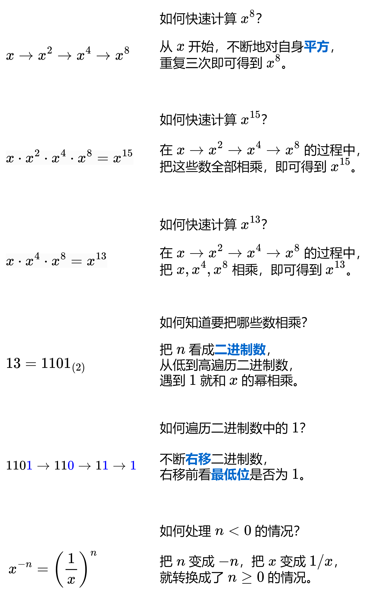
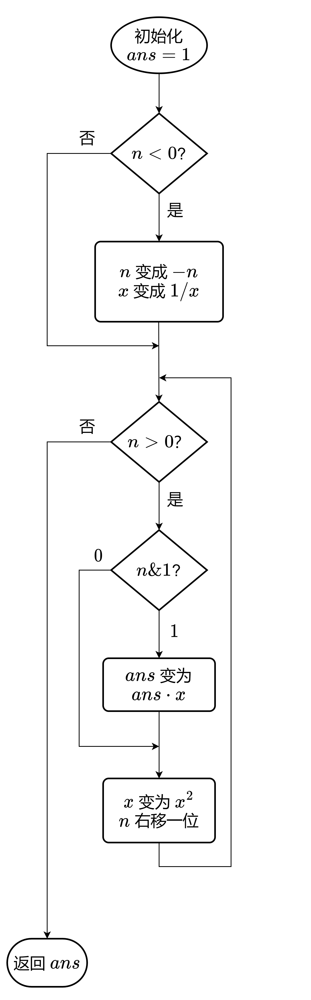

# 快速幂计算



算法流程如下：


代码实现：
```cpp
class Solution
{
    public myPow(double x,double N)
    {
        //求的是 x^n
        double ans=1;
        long long n=N;
        if(n<0)//x^-n=(1/x)^n
        {
            n=-n;
            x=1/x;
        }
        while(n)//从低到高枚举n的每个比特位
        {
            if(n&1)//如果比特位为1
            {
                ans*=x;//把x乘到ans中
            }
            x*=x;//x自身平方
            n>>=1;//继续枚举下一个比特位
        }
        return ans;
    }
}
```

