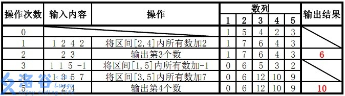

# 线段树

线段树（Segment Tree）是一种非常高效的树形数据结构，用于解决区间查询和修改问题。本文将通过分步骤讲解，带领读者熟练掌握线段树的原理与实现，并探索其应用场景。

## 引言：数组区间修改问题

线段树要解决这样一个经典问题：比如给定一个数组，频繁地需要进行以下操作：

1. **区间查询**：查询数组某一子区间内的**最大值、最小值、总和**等。假定我们总要反复求某个区间内的元素和。
2. **区间修改**：将某个子区间的所有值都进行一次操作，假定我们总要将区间内所有数增加一个固定数值。

暴力来说，我们直接在原数组上求和和修改即可。对于区间查询，我们可以每次直接遍历子区间计算结果；对于区间修改，可以遍历整个子区间进行更新。然而，区间长度最长可以是几乎整个数组长度，这种方法的时间复杂度为 O(n)，如果操作频繁且数组较大，效率会变得不可接受。

我们需要一种数据结构能够在单次 O(logn) 的时间内完成上述操作。线段树应运而生。

## 线段树的结构与实现

线段树是一种二叉树，用于高效地存储和操作区间信息。

### 1. 从区间到二叉树

线段树将数组下标空间反复二分划分为多个区间，并使用二叉树存储这些区间的信息：

* **叶节点**：表示数组的单个元素。
* **内部节点**：表示某一子区间的汇总信息（如区间和、最大值等）。

例如，给定数组 `[1, 3, 5, 7, 9, 11]`，其线段树如下：

```css
	              [0, 5]

	             /       \

	        [0, 2]       [3, 5]

	       /     \       /     \

	   [0, 1]  (2, 2) [3, 4]  (5, 5)

	  /    \          /    \

	(0, 0)(1, 1)  (3, 3)(4, 4)
```

小括号为叶节点，即本元素值；中括号即储存区间信息的额外节点，在本题里，他储存区间的总和，这个值由左右儿子计算得出。

### 2. 空间复杂度与 4 倍数组

普通数组只占用 1 倍空间，不需要多余数据，而线段树的二叉树通常用数组表示。对于大小为 n 的数组，线段树数组的大小通常是 4n，这是因为：

1. 线段树是一棵完全二叉树，其节点数不超过 2n−1。
2. 但预分配时考虑到最坏情况（非 2 的幂次）会增加存储需求，为了叶节点的左右空节点也仍无需特殊处理，为了简化代码实现，我们直接分配数组大小为 4n，确保不会越界，形成了惯例。

当然空间复杂度是 O(n) 的，变化的仅系数。你可以对比上例的数组理解。

### 3. 线段树的构建

以下是构建线段树的代码示例：

```c++
#include<bits.stdc++.h>
using namespace std;
vector<int>arr;//存储原数据的数组
vector<int>tree;//将原数组改为线段树存储
vector<int>lazy;//懒标记数组，用于区间修改函数
void build(int node,int start,int end)//node为在tree数组中哪个节点，其表示的区间为[satrt,end]
{
    if(start==end)//叶节点
        tree[node]=arr[start];
    else
    {
        //非叶节点被继续二分
        int mid=(start+end)/2;
        //示例中节点从1开始，所以左右节点序号如下。如果从0开始则leftChild=node*2+1,rightChild=node*2+2
        int leftChild=node*2;
        int rightChild=node*2+1;
        build(leftChild,start,mid);
        build(rightChild,mid+1,end);
        tree[node]=tree[leftChild]+tree[rightChild];
    }
    return;
}
```

## 区间查询与修改

### 1. 区间查询

线段树支持高效的区间查询，通过分治法将问题划分为子区间处理。要求某个区间内所有数的和，只需要将在线段树里不断拆分区间。以下是实现代码：
```c++
int query(int node,int start,int end,int l,int r)//[l,r]为查询区间
{
    if(r<start||l>end)//两个区间完全不相交
        return 0;
    if(l<=start&&end<=r)//[l,r]完全包含[start,end]
        return tree[node];
    //部分包含，有交集
    int mid=(start+end)/2;
    int leftChild=node*2;
    int rightChild=node*2+1;
    int leftSum=query(leftChild,start,mid,l,r);
    int rightSum=query(rightChild,mid+1,end,l,r);
    return leftSum+rightSum;
}
```

### 2. 单点修改

假如要修改数组中的一个元素，那么只要从上往下一路查找到底即可，而底节点改变影响父节点的值，递归结束后重新计算和即可。我们需要更新线段树：
```c++
void update(int node,int start,int end,int idx,int val)//idx是要修改的元素在arr数组的索引，val为要修改的值
{
    if(start==end)
        tree[node]=val;
    else
    {
        int mid=(start+end)/2;
        int leftChild=node*2;
        int rightChild=node*2+1;
        if(idx<=mid)
            update(leftChild,start,mid,idx,val);
        else
            update(rightChild,mid+1,end,idx,val);
        tree[node]=tree[leftChild]+tree[rightChild];
    }
}
```

#### 例题 [P3374 【模板】树状数组 1 - 洛谷 | 计算机科学教育新生态](https://www.luogu.com.cn/problem/P3374)

# 【模板】树状数组 1

## 题目描述

如题，已知一个数列，你需要进行下面两种操作：

- 将某一个数加上 $x$

- 求出某区间每一个数的和

## 输入格式

第一行包含两个正整数 $n,m$，分别表示该数列数字的个数和操作的总个数。   

第二行包含 $n$ 个用空格分隔的整数，其中第 $i$ 个数字表示数列第 $i$ 项的初始值。

接下来 $m$ 行每行包含 $3$ 个整数，表示一个操作，具体如下：

- `1 x k`  含义：将第 $x$ 个数加上 $k$

- `2 x y`  含义：输出区间 $[x,y]$ 内每个数的和

## 输出格式

输出包含若干行整数，即为所有操作 $2$ 的结果。

## 样例 #1

### 样例输入 #1

```
5 5
1 5 4 2 3
1 1 3
2 2 5
1 3 -1
1 4 2
2 1 4
```

### 样例输出 #1

```
14
16
```

## 提示

【数据范围】

对于 $30\%$ 的数据，$1 \le n \le 8$，$1\le m \le 10$；   
对于 $70\%$ 的数据，$1\le n,m \le 10^4$；   
对于 $100\%$ 的数据，$1\le n,m \le 5\times 10^5$。

数据保证对于任意时刻，$a$ 的任意子区间（包括长度为 $1$ 和 $n$ 的子区间）和均在 $[-2^{31}, 2^{31})$ 范围内。


样例说明：

  

故输出结果14、16

```c++
#include<bits/stdc++.h>
using namespace std;

vector<int> tree;
vector<int> arr;

// 建树
void build(int node, int start, int end) {
    if (start == end) {
        tree[node] = arr[start]; // 使用1-based索引
    } else {
        int mid = (start + end) / 2;
        int leftNode = node * 2;      // 左孩子节点
        int rightNode = node * 2 + 1; // 右孩子节点
        build(leftNode, start, mid);
        build(rightNode, mid + 1, end);
        tree[node] = tree[leftNode] + tree[rightNode];
    }
}

// 区间查询
int query(int node, int start, int end, int l, int r) {
    if (r < start || l > end) {
        return 0; // 区间不相交
    }
    if (l <= start && end <= r) {
        return tree[node]; // 完全包含
    }
    int mid = (start + end) / 2;
    int leftNode = node * 2;
    int rightNode = node * 2 + 1;
    int leftSum = query(leftNode, start, mid, l, r);
    int rightSum = query(rightNode, mid + 1, end, l, r);
    return leftSum + rightSum; // 返回左右子树的和
}

// 单点修改
void update(int node, int start, int end, int idx, int val) {
    if (start == end) {
        tree[node] += val; // 更新叶子节点
    } else {
        int mid = (start + end) / 2;
        int leftNode = node * 2;
        int rightNode = node * 2 + 1;
        if (idx <= mid) {
            update(leftNode, start, mid, idx, val); // 更新左子树
        } else {
            update(rightNode, mid + 1, end, idx, val); // 更新右子树
        }
        tree[node] = tree[leftNode] + tree[rightNode]; // 更新当前节点
    }
}

int main() {
    int n, m;
    cin >> n >> m;
    arr.resize(n + 1);      // 1-based数组
    tree.resize(4 * (n + 1)); // 线段树大小为4*(n+1)

    for (int i = 1; i <= n; i++) {
        cin >> arr[i]; // 输入1-based数组
    }

    build(1, 1, n); // 从根节点1开始建树，区间为[1, n]

    while (m--) {
        int k, x, y;
        cin >> k >> x >> y;
        if (k == 1) {
            update(1, 1, n, x, y); // 单点更新，x是1-based索引
        } else if (k == 2) {
            cout << query(1, 1, n, x, y) << endl; // 区间查询，x和y是1-based索引
        }
    }

    return 0;
}
```

### 3. 区间修改：懒标记

这是线段树最难的一部分。线段树通过**懒标记（Lazy Propagation）**来优化区间修改。**核心思想**：延迟更新，将修改操作记录在标记数组中，仅在必要时更新。

具体来说，假如我们要修改某个区间的值（比如都增加 *a*），我们仍将其分割到几个子区间，若某区间被完全包含，那么我们就不再向下递归，而是仅对该节点修改，并在该节点处的懒标记设为 *a*，表明我的所有子节点都应该加上 *a*，但是尚未实际操作。直到后续某次查询来到这里时，我们才将懒标记清空，并将其向下推一层。
```c++
void pushDown(int node,int start,int end)//下推懒标记
{
    if(lazy[node]!=0)
    {
        int mid=(start+mid)/2;
        int leftChild=node*2;
        int rightChild=node*2+1;
        //更新左右孩子的值
        tree[leftChild]+=(mid-start+1)*lazy[node];
        tree[rightChild]+=(end-mid)*lazy[node];
        //下推懒标记
        lazy[leftChild]+=lazy[node];
        lazy[rightCild]+=lazy[node];
        //当前节点的懒标记
        lazy[node]=0;
    }
}

void updateRange(int node,int start,int end,int l,int r,int val)//区间修改
{
    if(r<start||l>end)//区间不相交
        return;
    if(l<=start&&end<=r)//完全包含
    {
        tree[node]+=val*(end-start+1);
        lazy[node]+=val;
        return;
    }
    //部分包含，下推懒标记
    pushDown(node,start,end);
    int mid=(start+end)/2;
    int leftChild=node*2;
    int rightChild=node*2+1;
    updateRange(leftChild,start,mid,l,r,val);
    updateRange(rightChild,mid+1,end.l,r,val);
    //更新当前节点的值
    tree[node]=tree[leftChild]+tree[rightChild];
}
```

仍循上例，将[1,4][1,4]都增加 1，我们发现在[3,4][3,4]处就进行标记，并不再向下传播。由此，区间修改的操作量和区间查询是一致的。若没有懒标记，则每次修改都会推到最底部，这比暴力还劣。所以懒标记是线段树的必须项，而非锦上添花。

虽然其子树的值暂不正确，但是访问子树一定会经过懒标记，当以后任何情况下再次来到这里，都一定会经过懒标记并将其下推，保证了只要你访问了子树。结果总是正确。由此，**<u>区间查询和单点修改函数</u>**<u>**也需要添加下推标记段**</u>（即`if (lazy[node] != 0)` 部分）。

懒标记就像一个勤快又善于偷懒的管理员，负责照看一片大田地。每当需要给某些田地施肥时，如果整片田地都需要相同的肥料，他会在大门口挂一个牌子，写上“这片田地需要施肥”，但暂时不实际行动。这意味着，他不用一块一块地跑下去忙碌，但是等到有人真正走进田地时，他就会立刻施肥，并顺手把任务分配给更小的田地。这样既节省了时间，又确保了田地里的作物都能及时得到照顾，每个走进田地的人都看到的是已施肥后的土地。懒标记的“懒”，只是暂缓处理；而他的“勤”，则体现在始终精准地完成所有任务！

#### 例题[P3368 【模板】树状数组 2 - 洛谷 | 计算机科学教育新生态](https://www.luogu.com.cn/problem/P3368)

# 【模板】树状数组 2

## 题目描述

如题，已知一个数列，你需要进行下面两种操作：

1. 将某区间每一个数加上 $x$；

2. 求出某一个数的值。

## 输入格式

第一行包含两个整数 $N$、$M$，分别表示该数列数字的个数和操作的总个数。

第二行包含 $N$ 个用空格分隔的整数，其中第 $i$ 个数字表示数列第 $i $ 项的初始值。

接下来 $M$ 行每行包含 $2$ 或 $4$个整数，表示一个操作，具体如下：

操作 $1$： 格式：`1 x y k` 含义：将区间 $[x,y]$ 内每个数加上 $k$；

操作 $2$： 格式：`2 x` 含义：输出第 $x$ 个数的值。

## 输出格式

输出包含若干行整数，即为所有操作 $2$ 的结果。

## 样例 #1

### 样例输入 #1

```
5 5
1 5 4 2 3
1 2 4 2
2 3
1 1 5 -1
1 3 5 7
2 4
```

### 样例输出 #1

```
6
10
```

## 提示

#### 样例 1 解释：

  

故输出结果为 6、10。

---

#### 数据规模与约定

对于 $30\%$ 的数据：$N\le8$，$M\le10$；

对于 $70\%$ 的数据：$N\le 10000$，$M\le10000$；

对于 $100\%$ 的数据：$1 \leq N, M\le 500000$，$1 \leq x, y \leq n$，保证任意时刻序列中任意元素的绝对值都不大于 $2^{30}$。

```c++
#include<bits/stdc++.h>
using namespace std;
vector<int>arr;
vector<int>tree;
vector<int>lazy;
//建树 
void build(int node,int start,int end)
{
	if(start==end)
		tree[node]=arr[start];
	else
	{
		int mid=(start+end)/2;
		int leftChild=node*2;
		int rightChild=node*2+1;
		build(leftChild,start,mid);
		build(rightChild,mid+1,end);
		tree[node]=tree[leftChild]+tree[rightChild];
	}
}
void pushDown(int node,int start,int end)
{
	if(lazy[node]!=0)
	{
		int mid=(start+end)/2;
		int leftChild=node*2;
		int rightChild=node*2+1;
		tree[leftChild]+=(mid-start+1)*lazy[node];
		tree[rightChild]+=(end-mid)*lazy[node];
		lazy[leftChild]+=lazy[node];
		lazy[rightChild]+=lazy[node];
		lazy[node]=0;
	}
}
//查询区间和 [l,r]
int query(int node,int start,int end,int l,int r)
{
	//没有任何交集 
	if(r<start||l>end)
		return 0;
	else if(start>=l&&end<=r)//完全包含 
	{
		return tree[node];
	}
	else//部分包含 
	{
		pushDown(node,start,end);
		int mid=(start+end)/2;
		int leftChild=node*2;
		int rightChild=node*2+1;
		return query(leftChild,start,mid,l,r)+query(rightChild,mid+1,end,l,r);
	}
}

//区间修改
void updateRange(int node,int start,int end,int l,int r,int val)
{
	
	if(r<start||l>end)
		return ;
	if(l<=start&&r>=end)
	{
		tree[node]+=val*(end-start+1);
		lazy[node]+=val;
		return;
	}
	pushDown(node,start,end);
	int mid=(start+end)/2;
	int leftChild=node*2;
	int rightChild=node*2+1;
	updateRange(leftChild,start,mid,l,r,val);
	updateRange(rightChild,mid+1,end,l,r,val);
	tree[node]=tree[leftChild]+tree[rightChild];
 } 
int main()
{
	int n,m;
	cin>>n>>m;
	arr.resize(n+1);
	tree.resize(4*(n+1));
	lazy.resize(4*(n+1),0);
	for(int i=0;i<n;i++)
	{
		cin>>arr[i+1];
	}
	build(1,1,n);
	int choose;
	while(m--)
	{
		cin>>choose;
		if(choose==1)
		{
			int x,y,k;
			cin>>x>>y>>k;
			updateRange(1,1,n,x,y,k);
		}
		else if(choose==2)
		{
			int x;
			cin>>x;
			cout<<query(1,1,n,x,x)<<endl;
		}
	}
	return 0;
}
```

