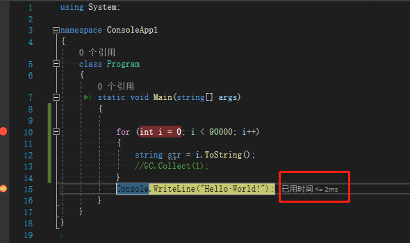

# 垃圾回收机制(GC)的理解（资源清理+内存管理）

## 什么是[垃圾回收](https://so.csdn.net/so/search?q=垃圾回收&spm=1001.2101.3001.7020)：

在编写程序时，会产生很多的数据 比如:int string 变量，这些数据都存储在内存里，如果不合理的管理他们，就会[内存溢出](https://so.csdn.net/so/search?q=内存溢出&spm=1001.2101.3001.7020)导致程序崩溃

C#内置了自动垃圾回收GC，在编写代码时可以不需要担心内存溢出的问题 变量失去引用后 GC会帮我们自动回收，但不包括数据流，和一些数据库的连接，这就需要我们手动的释放资源

> 总结：让内存利用率更高

## 什么样子的对象才会给回收？

GC只会回收 堆 的内存 ，而 值类型在 栈 中的使用完后马上就会给释放，并不需要 GC 进行处理，堆中的没有被引用或者null的对象才会被回收，静态的变量也不会被回收

上面说到他并不会回收一些数据流

> 比如: Stream StreamReader StreamWrite HttpWebResponse 网络端口 等还有一些数据库的连接
> 这些对象需要调用 Close() 或者 [Dispose](https://so.csdn.net/so/search?q=Dispose&spm=1001.2101.3001.7020)() 方法进行 手动回收

> 总结：没有被引用的对象 或为 null的

## 什么时候进行垃圾回收？

什么时候回收这些都由操作系统决定，一般不需要进行理会全由系统调用，如有特殊情况，明确的需要进行释放 也可以强制的垃圾回收

> GC.Collect()
> 正常情况下 非常不建议使用这方法，这会让程序暂停但时间很短，会影响执行效率

需要注意的是 给释放后的内存是无法在找回的

> 总结：由操作系统决定 但也可以强制释放 正常情况不需要理会内存问题

## 效率问题（重要）

除非马上需要进行非常消耗内存的操作 其他情况尽量不要调用GC.Collect();

测试：

```csharp
 for (int i = 0; i < 90000; i++)
{
  string str = i.ToString();
}
//假装我是一个方法哈
12345
```

> 测试时间：2毫秒
> 

假如每次使用完方法后强制垃圾回收

```csharp
for (int i = 0; i < 90000; i++)
{
    string str = i.ToString();
    //假装我是一个方法哈
    GC.Collect(1);
}
123456
```

> 测试时间：1022毫秒
> 

[性能](https://marketing.csdn.net/p/3127db09a98e0723b83b2914d9256174?pId=2782&utm_source=glcblog&spm=1001.2101.3001.7020)相差500倍

## “代”的机制

使用代的机制进行垃圾回收 可以大大的提示垃圾回收的性能

垃圾回收共分3代

> 索引 【0】【1】 【2】共3个

每次创建对象的时候 都是在第0代 分配内存 并且每一代都配有初始内存空间


假设现在程序已经跑了一段时间了 而第0代分配的2MB的空间已满了


**这时候就会进行 垃圾回收 把失去引用的对象释放** 此时未使用完的对象将进入到第1代


垃圾回收后 第0代就已经空了 后面创建的对象就会重新放入第0代


以此类推 0代满后 又会重新垃圾回收 还在使用的对象又会放入第1代

此后运行一段时间 1代也已经满了 而0代还在使用的对象也会移动到1代 这时候已经不够放了 又会进行垃圾回收 1代的将移动到2代 0代的将移动到1代


以此类推

> 假如我代数都满了 但对象我都还在使用 并没有回收多少 这时GC就会自动的把初始内存给扩大 比如原来2MB 扩大到4MB 还不够使用的情况下就会抛出异常

```csharp
int n  =GC.MaxGeneration;
//获取系统支持最大的代数【我的电脑是2】
12
 GC.Collect(1); 
   //指定回收第2代内存   注意从0开始
12
```

## 析构[函数](https://marketing.csdn.net/p/3127db09a98e0723b83b2914d9256174?pId=2782&utm_source=glcblog&spm=1001.2101.3001.7020)

该函数是在类使用完成后调用的，一些非托管资源 Sream 可以在此处调用Dispose()方法进行释放内存，一个类只有一个析构函数而且无法继承他

```csharp
~Class1()
        {
            Console.WriteLine("我给调用了");
        }
1234
```

但有时候该函数并不会调用，无法控制何时调用析构函数，因为这是由垃圾回收器决定的，在垃圾回收时先运行析构函数再回收其他对象。

```csharp
using System;

namespace ConsoleApp1
{
    class Program
    {
        static void Main(string[] args)
        {

            Class1 c = new Class1();
            c.A();
            Console.WriteLine("End");
        }
    }

    class Class1
    {
        public void A()
        {
            Console.WriteLine("xxxx");
        }

        ~Class1()
        {
            Console.WriteLine("我给调用了");
        }
    }
}
12345678910111213141516171819202122232425262728
```

结果：


可以看到 析构函数 并没有给使用，假如你写的是一些释放资源的方法，那也不会执行该函数。

[[垃圾回收的基本知识 - .NET | Microsoft Learn](https://learn.microsoft.com/zh-cn/dotnet/standard/garbage-collection/fundamentals)]:

