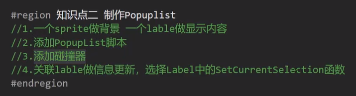

# NGUI

## 三大基础组件

### **Root : 控制分辨率自适应的基础**

> **分辨率概念**


> **Root是用来干啥的**


> **Root相关参数**

```c#
Scaling Style:缩放模式
	Flexible：灵活模式   一般用于PC端
```


```c#
Constrained: 约束模式
    做竖屏游戏只勾选content width
    做横屏游戏只勾选content height
```


```c#
Constrained on Mobiles
```


> **总结**


### Panel：控件显示的基础

> **Panel用来干啥**

1.管理一个UI面板的渲染顺序

2.管理一个UI面板上的所有子控件

> **Panel参数相关**


> **总结**


### Event System(Uicamera):输入事件监听的基本组件

> **EventSystem是用来干啥的**


> **参数相关**


> **总结**


## 图集制作

> **图集用来干什么**


> **打开图集制作工具**


> **新建图集**


## 三大基础控件

### Sprite精灵图片

> **Sprite用来做什么**


> **Sprite参数**


sliced:切片模式


> **代码设置图片**

```c#
public UISprite sprite;
//改成同一图集中其他图片
sprite.spriteName="bk";
//改成其他图集中的图片
	//先加载图集
NGUIAtlas atlas=REsource.Load<NGUIAtlas>("Atlas/login");
sprite.atlas=atlas;
	//再设置图片
sprite.spriteName="name";
```

### Label文本控件

> **Label用来干什么**

NGUI中所有文本显示都使用Label来显示

> **创建Label**

直接创建即可

> **Label参数**


> **富文本**


> **代码设置Label**

```c#
public UILabel label;

label.text="159753";
```

### Texture大图控件

> **Texture用来干什么**


> **参数相关**


> **代码设置**

```c#
public Texture tx;
//加载图片
Texture texture=Resources.Load<Texture>("path");
if(texture!=null)
{
    tx.mainTexture=texture;
}
```

## 组合控件

> **所有组件的共同特点**

1.在3个基础组件对象上添加相应组件（脚本）

2.如果希望响应点击等事件，需要添加碰撞器

### Button按钮

> **制作Button**


> **参数相关**


> **监听事件的两种方式**

OnClick可以关联多个对象的脚本

1.拖脚本：方法必须是public的，先把脚本拖到对象上，再把对象拖到button的OnClick上

2.代码设置：

```c#
public UIButton btn;
//EventDelegate是一个无参无返回值的委托函数
btn.onClick.Add(new EventDelegate(ClickDoSomething));
btn.onClickAdd(new EventDelegate(()=>{print("lambda")}))
public void ClickDoSomething()
{
    print("a");
}
```

### Toggle单选多选框

> **制作Toggle**


> **参数相关**


> **监听事件的两种方式**

和Button组件一样

### Input文本输入控件

> **制作Input**


> **参数相关**


> **监听事件的两种方式**

和Button一样

### Popuplist下拉列表控件

> **制作PopupList**



> **参数相关**


> **监听事件的两种方式**


### Silder滑动条控件

> **制作Slider**


碰撞器添加到背景上时，点击背景就可以更改进度条，
挂在滑块上时，只能通过滑块来滑动

> **参数相关**


> **监听事件的两种方式**

1.拖脚本

2.写代码

```c#
onChange()
onDragFinished()
```


### ScrollBar滚动条和ProgressBar进度条

> **ScrollBar和ProgressBar用来干啥**


> **制作ScrollBar**


> **制作ProgressBar**


### ScrollView滚动视图

> **ScrollView是用来干啥的**


> **制作ScrollView**


```
ScrollView sv;
sv.UpdateScrollbars();//通过代码控制滚动条更新
```


> **参数相关**

通过panel脚本调整可视范围


> **自动对齐脚本：Grid脚本**


## Anchor锚点组件

> **Anchor是什么**


> **老版本锚点组件**


> **新版本-基础控件自带锚点信息**


## NGUI进阶

### EventListener和EventTrigger特殊事件监听

> **控件自带事件的局限性**


> **NGUI事件 响应函数**


```
OnDragOver(GameObject obj)
OnDragOut(GameObject obj)
中的obj均是拖拽的物体
```

**缺点：**给子控件添加功能时需要单独写脚本，面向对象思想减弱

> 更加方便的UIEventListener和UIEventTrigger


### Drawcall

> **Drawcall的概念**


> **如何降低DrawCall数量**

- 在UI层面上
  小图合大图->即多个小DrawCall贬义词大DrawCall

> **制作UI时降低DrawCall的技巧**

- 通过NGUI Panel上提供的DrawCall查看工具
- 注意不同图集之间的层级关系
  同一图集拼面板时层级区间不要出现其他图集的图片，会增加DrawCall数量
- 注意Label的层级关系

### NGUI字体

> **NGUI字体的作用**

1.降低DrawCall

2.自定义美术字体

> **制作NGUI字体**


> **Unity动态字体和NGUI字体如何选择**

- 文字变化较多的用Unity动态字体，变化较少用NGUI字体
- 想要减少DRawCall用NGUI字体
- 美术字体用NGUI字体

### NGUI缓动

> **NGUI缓动是什么**


> **使用NGUI缓动**


> **Tween Scale参数相关**


> **Play Tween组件**


### 模型和粒子显示在UI之前

> **NGUI中显示3D模型**


2.主摄像机不要渲染UI层
4.3D模型不受depth影响，只受z轴影响

> **NGUI中显示粒子特效**


### 其他

> **NGUI事件响应播放音效**

PlaySound脚本

> **NGUI控件和键盘按键绑定**

KeyBinding脚本

> **PC端 tab键快速切换选中**

KeyNavigation脚本

> **语言本地化**


```cpp
Localization.language="简体中文";//修改语言
```

