# Unity基础

---

## 3D数学

### MathF

#### MathF和Math


#### MathF中的常用方法

```c#
Mathf.PI
```

```c#
Mathf.Abs(num)
```

```c#
Mathf.CeilToInt(1.3)//向上取整，强转向下取整
```

```c#
Mathf.FloorToInt(1.6)//向下取整
```

```c#
Mathf.Clamp(num,min,max)//比max大取max，比min小取min，在中间取自己
```

```c#
Mathf.Max(1,2,3)//获取最大值
```

```c#
Mathf.Min(1,2,3)//获取最小值
```

```c#
Mathf.Pow(num,n)//一个数的n次幂
```

```c#
Mathf.RoundToInt(num)//四舍五入
```

```c#
Mathf.Sqrt(num)//返回一个数的平方根
```

```c#
Mathf.IsPowerOfTwo(num)//判断是否是2的n次方 return bool
```

```c#
Mathf.Sign(num)//判断正负数 return float,正数为1，负数为-1，0看做正数
```

#### 插值运算 - Lerp

```c#
result=Mathf.Lerp(start,end,t);
```


### 三角函数

#### 角度和弧度


#### 弧度角度相互转换

```c#
Mathf.Rad2Deg//弧度转角度
```

```c#
Mathf.Deg2Rad//角度转弧度
```


#### 三角函数

```c#
Mathf.Sin(rad)//传入的参数需要是弧度值
Mathf.Cos(rad)
```

#### 反三角函数

反三角函数得到的结果是正弦或者余弦值对应的弧度

```c#
Mathf.Asin()
Mathf.Acos()
```

### 坐标系

#### 世界坐标系


#### 物体坐标系


#### 屏幕坐标系


#### 视口坐标系

摄像机上的视口范围


#### 坐标转换


### 向量

#### 向量基础


#### 两点决定一向量


#### 零向量和负向量


#### 向量的模长


```c#
Vector3 a=new Vector3(1,1,1);
a.magnitude//获取向量模长的成员属性
```


#### 单位向量


#### 向量加减乘除

##### 加法


##### 减法


##### 乘除法


#### 向量点乘


##### 补充知识 调试画线


##### 通过点乘判断对象方位

```c#
Vector3.Dot(Vector3 a,Vector3 b)
```


##### 通过点乘推导公式算出夹角


##### 通过API计算夹角

```c#
Vector3.Angle(Vector3 a,Vector3 b)
```


#### 向量叉乘

##### 叉乘计算


```c#
Vector3.Cross(a.position,b.position)
```

##### 叉乘几何意义


```
AxB=|A|*|B|*sinθ
```

#### 向量插值运算

##### 线性插值


##### 球形插值


### Quaternion四元数

#### 为何使用四元数

##### 欧拉角


##### 万向节死锁


#### 四元数是什么

##### 四元数构成


##### 轴角对


##### 在unity中初始化


```c#
Quaternion.AngleAxis(角度，轴)
```

##### 四元数和欧拉角的相互转换


##### 四元数弥补的欧拉角缺点

四元数旋转后，转换后的欧拉角始终是-180~180°

四元数相乘代表旋转四元数


此处的vector3.up不是世界坐标系的，是物体自己坐标系的

#### 四元数常用方法

##### 单位四元数


```c#
Quaternion.identity
```

##### 插值运算


##### 向量指向转四元数


 

#### 四元数计算

##### 四元数相乘


##### 四元数乘向量


一定是四元数在前，向量在后，否则报错

##### unity绕轴旋转方向如何确定


## Mono中的重要内容

### 延迟（延时）函数

#### 什么是延迟函数


#### 延迟函数的使用


1-2是指延时函数只能调用无参函数，想调用有参函数，可将有参函数包裹在无参函数里

1-3指的是想要调用别的脚本上的函数，也将其包裹在本脚本的一个无参函数中


取消延时函数


判断是否有延迟函数


#### 延迟函数受对象失活影响

脚本依附对象失活或者脚本自己失活，延迟函数可以继续执行（可利用生命周期函数管理）


脚本依附对象销毁或者脚本移除，延迟函数无法继续执行

### 协同程序

##### Unity支持多线程

Unity新开线程无法直接访问Unity相关对象的内容
unity线程记得关闭，不然和unity编辑器共生

##### 协同程序是什么

“假”的多线程
主要作用：将代码分时执行，不卡主线程
主要使用场景：异步下载文件，异步加载文件，场景异步创建，批量创建时防止卡顿

##### 协同程序和线程的区别

新开一个线程是独立的一个管道，和主线程并行执行
新开一个协程是在原线程上开启，进行逻辑分时分步执行

##### 协程的使用

继承MonoBehavior的类都能开启协程函数

第一步：申明协程函数

- 协程函数返回值必须是IEnumerator或者是继承他的类型
- 协程函数必须使用yield return进行返回

第二步：开启协程函数
	协程函数不能直接像函数一样去调用

常用开启方式
- StartCoroutine(MyCoroutine())
- IEnumerator ie=MyCoroutine()
  StartCoroutine(ie)

第三步：退出协程函数
	关闭所有协程：`StopAllCoroutines()`
	关闭指定协程：

```c#
Coroutine c=StartCoroutinr(MyCoroutine());
StopCoroutine(c);
```

##### yield return 不同内容的含义

1. 下一帧执行

   - yield return 数字
   - yield return null

   在Update和LateUpdate之间执行

2. 等待指定秒后执行

   - yield return new WaitForSecond(秒)

   在Update和LateUpdate之间执行

3. 等待下一个固定物理帧更新时执行

   - yield return new WaitForFixedUpdate();

   在FixedUpdate和碰撞检测相关函数之后执行

4. 等待摄像机和GUI渲染完成后执行

   - yield return new WaitForEndOfFrame();//一般用于截图功能

   在LateUpdate之后的渲染相关处理完毕后执行

5. 一些特殊类型的对象，比如异步加载相关函数返回的对象，之后讲解，一般在Update和LateUpdate之间执行

6. 跳出协程
   yield break；

##### 协程受对象和组件失活销毁的影响

协程开启后，组件和物体销毁，协程不执行；物体失活协程不执行，组件（脚本）失活协程执行

#### 协程原理

##### 协程的本质

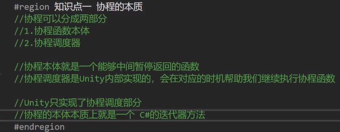

##### 协程本体是迭代器方法的体现

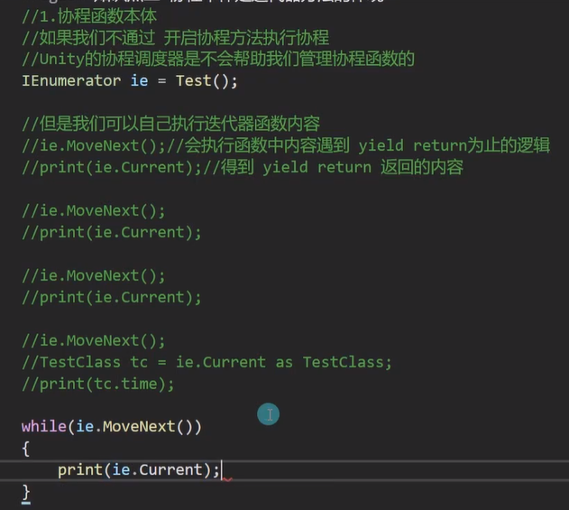

##### 协程调度器

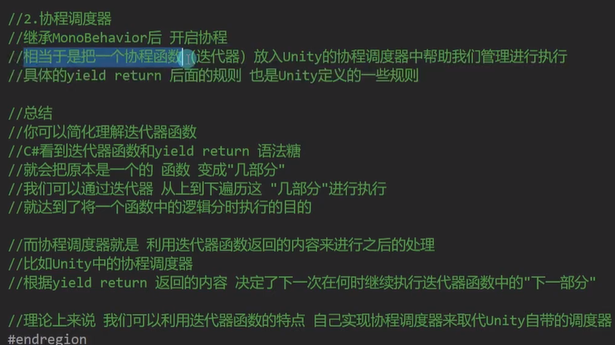

## Resources资源动态加载

### Unity中的特殊文件夹

#### 工程路径获取

```c#
Application.dataPath//该方式获取到的路径一般情况下只在编辑模式下使用，在游戏实际发布后，不会使用该路径，因为游戏发布过后，该路径就不存在了
```

#### Resources资源文件夹

手动创建这个文件夹，且名字不要拼错
获取：

```c#
Application.dataPath + "/Resources" //一般不进行路径获取，只能使用Resources相关API进行加载，如果硬要获取，可以用工程路径拼接
```

注意：
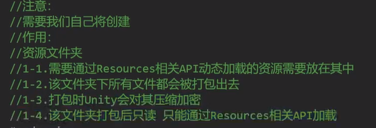

#### StreamingAssets 流动资源文件夹

路径获取：
```c#
Application.streamingAssetsPath//不能通过dataPath去拼接获取
```

注意：
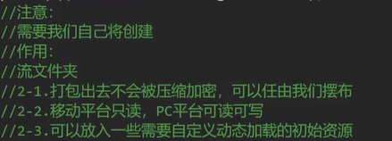

#### persistentDataPath 持久数据文件夹

路径获取：
```c#
Application.persistentDataPath
```

注意：
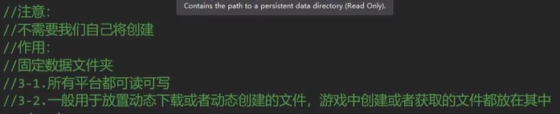

#### Plugins 插件文件夹

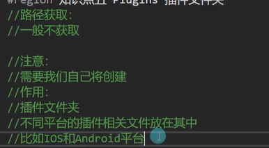

#### Editor 编辑器文件夹


#### Standard Assets 默认资源文件夹

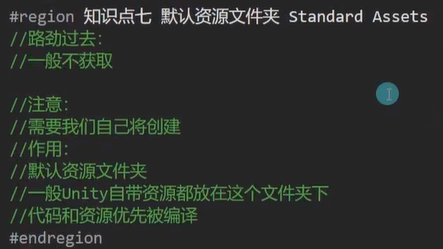

### Resources同步加载

#### Resurces资源动态加载的作用

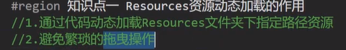

#### 常用资源类型

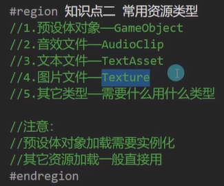

#### 资源同步加载 普通方法

```c#
Resources.Load("路径+name");//return Object
```

预设体资源
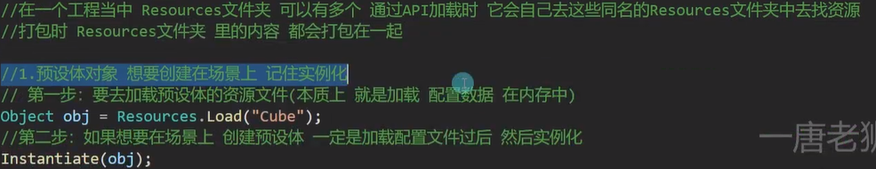

音效资源
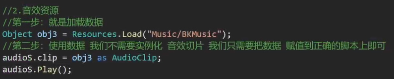

文本资源
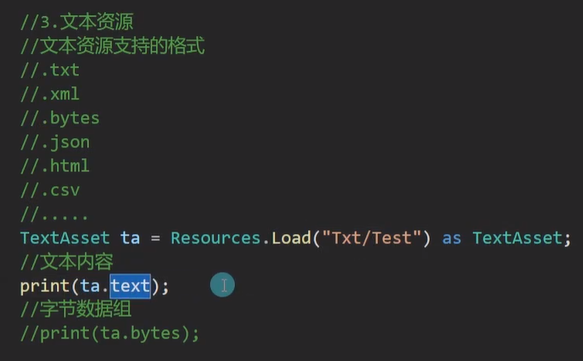

图片
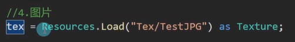

其他类型
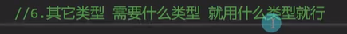

问题：资源同名怎么办
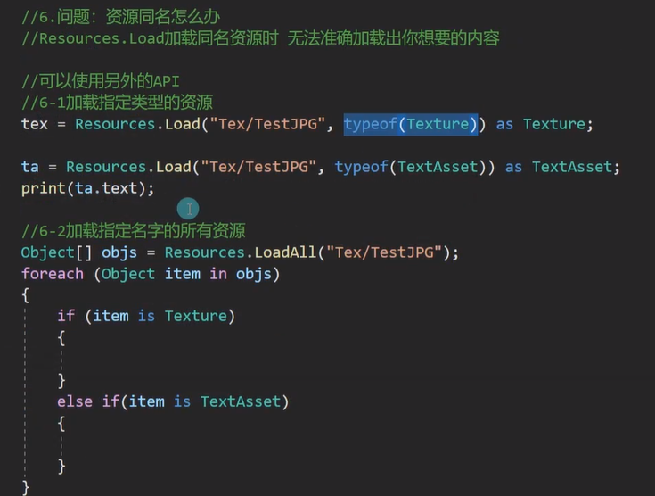

#### 资源同步加载 泛型方法

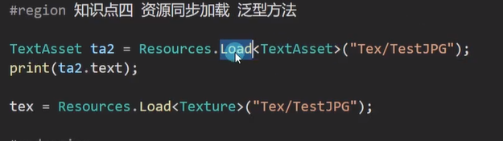

### Resources异步加载

#### Resources异步加载是什么

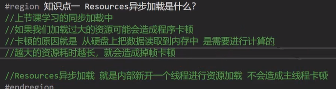

#### Resources异步加载方法

异步加载不能马上得到加载的资源，至少等一帧

1.通过异步加载中的完成事件监听，使用加载的资源

```c#
ResourceRequest rq=Resources.LoadAsync<T>(string path)
rq.completed += LoadOver;
private void LoadOver(AsyncOperation rq)
{
    //资源加载结束之后逻辑
    print("加载结束");
    (rq as ResourceRequest).asset//return object,asset是资源对象
}
```

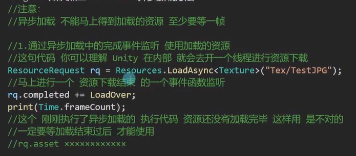

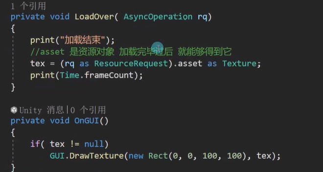

2.通过协程使用加载的资源

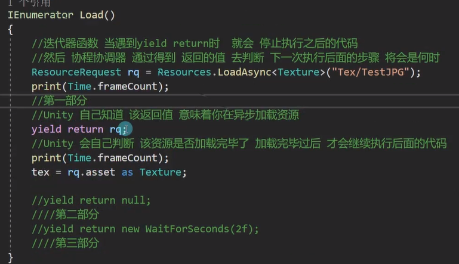

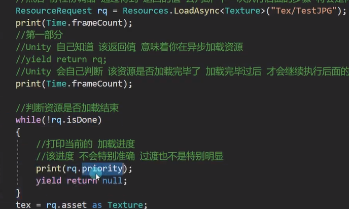

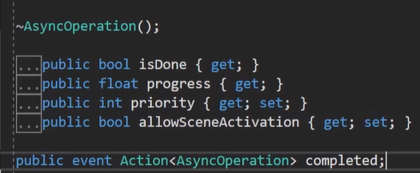

总结
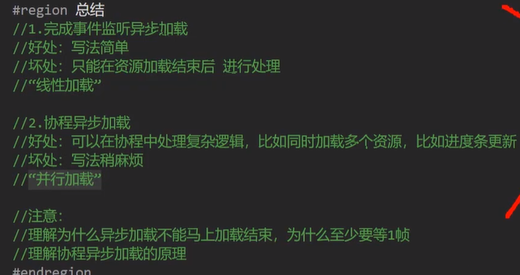

###  Resources卸载资源

#### Resources重复加载资源会浪费内存吗

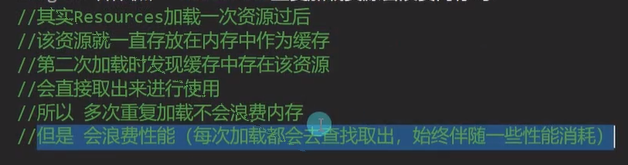

#### 如何手动释放缓存中的资源

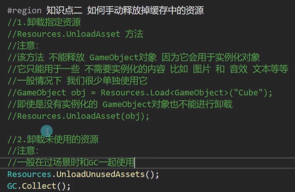

## 场景异步切换

##### 场景同步切换回顾

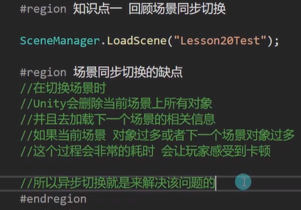

##### 场景异步切换

1.通过事件回调函数异步加载

```c#
AsyncOperation ao= SceneManager.LoadSceneAsync("Scene name");
ao.completed += (a)=>
{
    
};
```

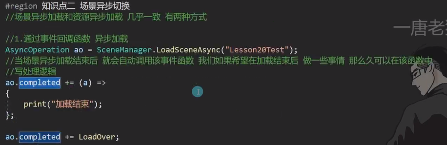

2.通过协程函数异步加载

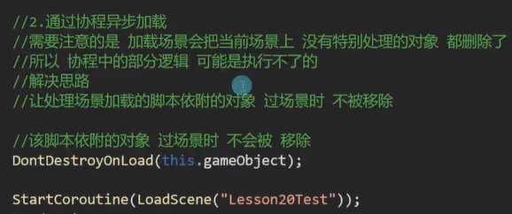

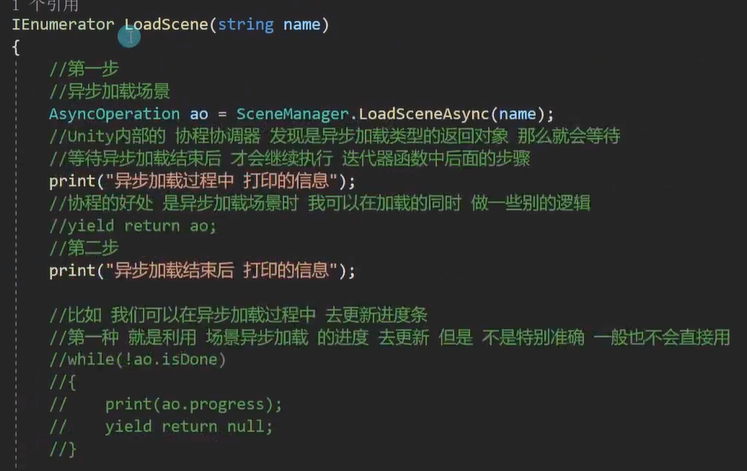

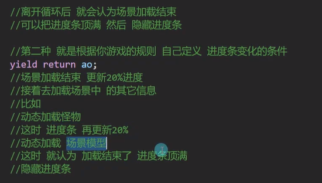

##### 总结

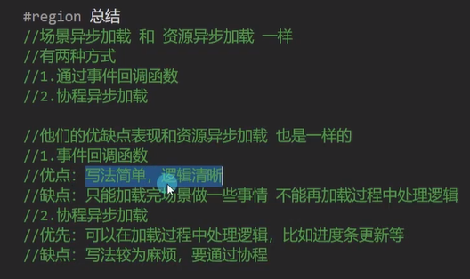

## 画线功能Linerenderer

### LineRenderer是什么？

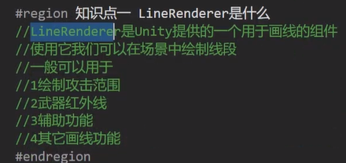

### LineRenderer参数相关

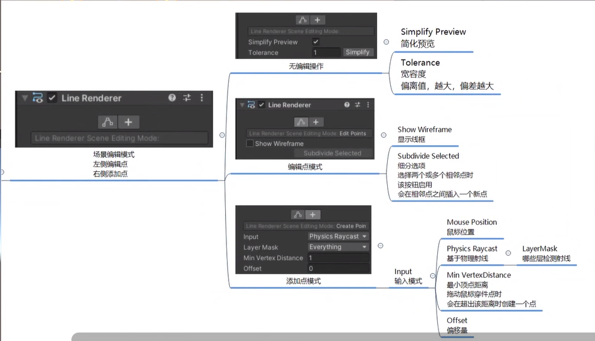

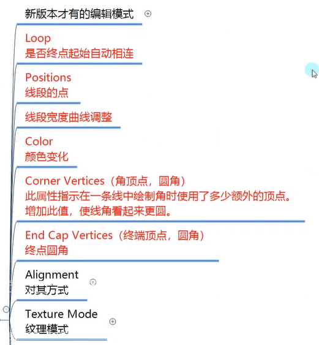

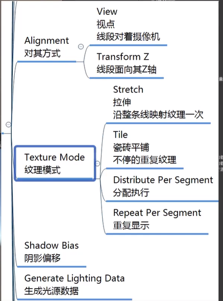

  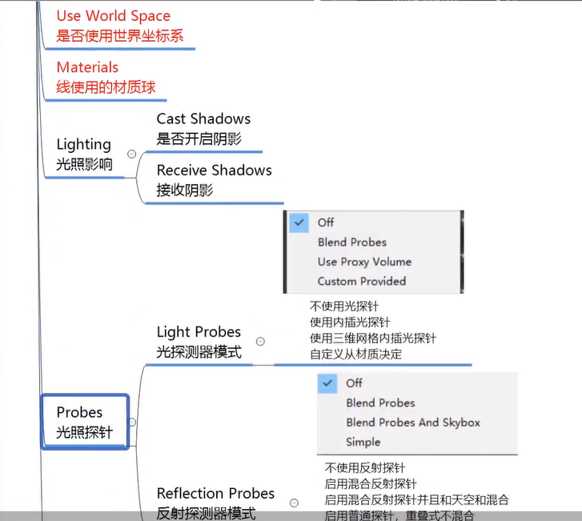

当使用世界坐标系时改，变物体坐标，线不会动

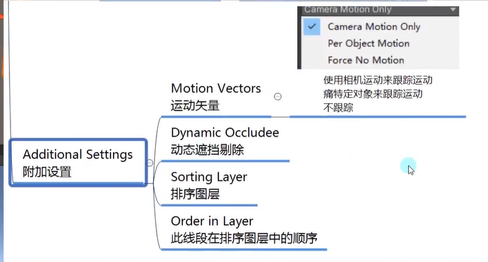

### LineRenderer代码相关

1. 动态添加一个线段
   ```c#
   GameObject line=new GameObject();
   line.name="Line";
   LineRenderer lr=line.AddComponent<LineRenderer>();
   ```

2. 首尾相连
   ```c#
   lr.loop=true;
   ```

3. 开始结束宽
   ```c#
   lr.startWidth=0.02f;
   lr.endWidth=0.02f;
   ```

4. 开始结束颜色
   ```c#
   lr.startColor=Color.white;
   lr.endColor=Color.red;
   ```

5. 设置材质
   ```c#
   Material m=Resources.Load<Material>("M");
   lr.material=m;
   ```

6. 设置点
   ```c#
   lr.positionCount=4;
   lr.SetPositions(new Vector3[]{
       new Vector3(0,0,0),
       new Vector3(0,0,5),
       new Vector3(5,0,5)
           //最后一个位置默认被赋值为{0,0,0}
   })
       lr.SetPosition(3,new Vector3(5,0,0));
       
   ```

   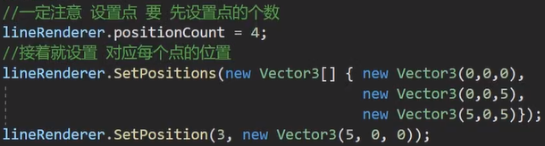

7. 是否使用世界坐标系
   ```c#
   lr.useWorldSpace=false;
   ```

8. 
   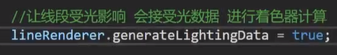

## 核心系统

### 物理系统之范围检测

#### 什么是范围检测？

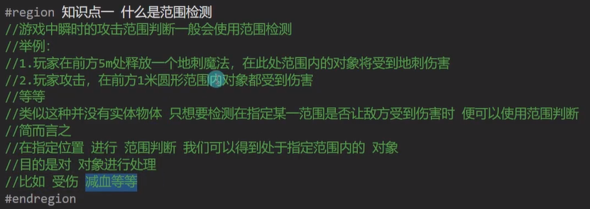

#### 如何进行范围检测？

**必备条件：**想要被范围检测的对象必须具有碰撞器
**注意点：**
1.范围检测相关API只有当执行该句代码时进行一次范围检测，它是瞬时的
2.范围检测相关API并不会真正产生一个碰撞器，只是碰撞计算而已

**范围检测API**

盒形范围检测

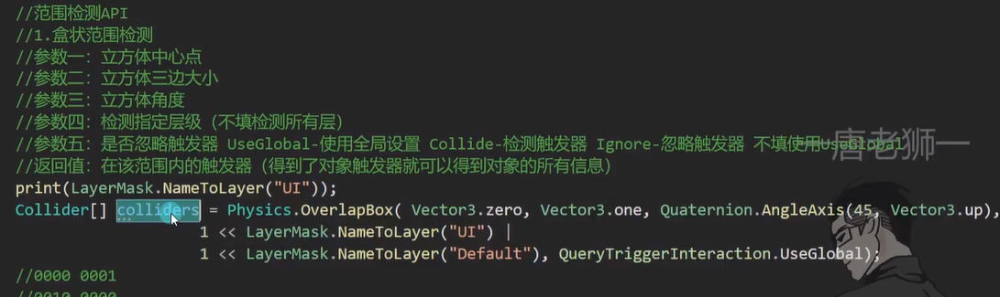
**size为半尺寸**

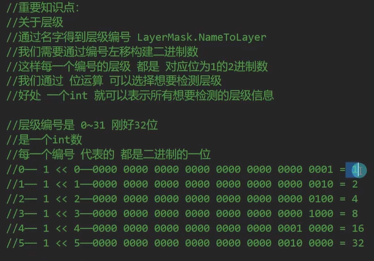

**另一个API**
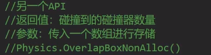

球形范围检测

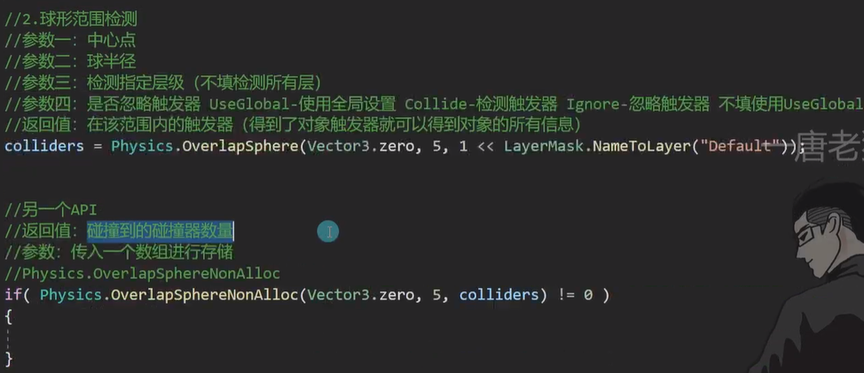

胶囊范围检测

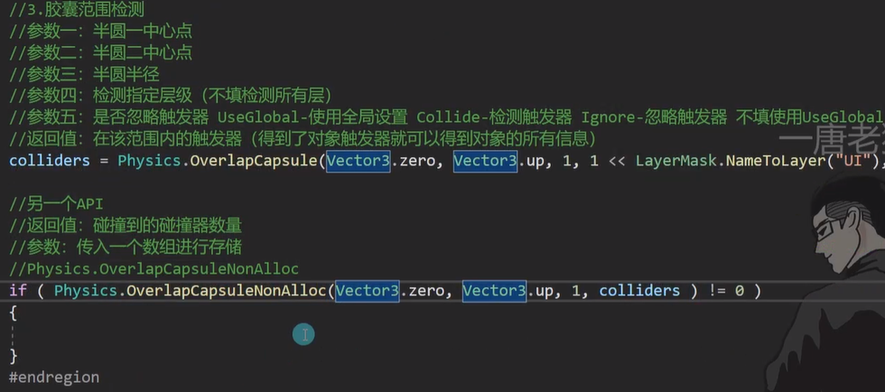

### 物理系统之射线检测

#### 什么是射线检测？

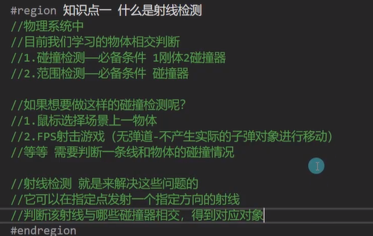

#### 射线对象

1.3D世界中的射线

```c#
Ray r=new Ray(Vector3 origin,Vector3 direction);//声名一个射线对象
```

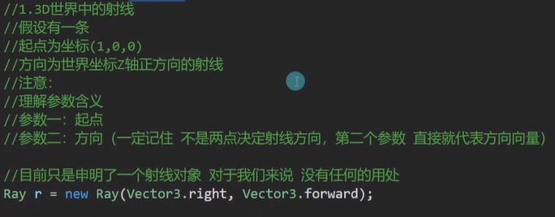
2.摄像机发射出的射线

```c#
Ray r=Camera.main.ScreenPointToRay(Input.mousePosition);
```

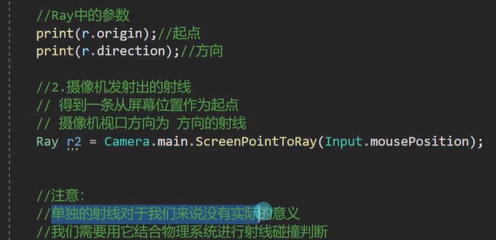

#### 碰撞检测函数

射线检测也是瞬时的，代码执行时进行一次射线检测

1.最原始的射线检测

```c#
Ray r=new Ray(Vector3.zero,Vector3.forward);
Physics.Raycast(r,1000,1<<LayerMask.NameToLayer("Monster"),QueryTriggerInteraction.UseGlobal);
//return bool
//只能检测到是否碰撞到了对象，得不到碰撞对象信息
//也可以传入射线的起点和方向，不直接传入射线
```

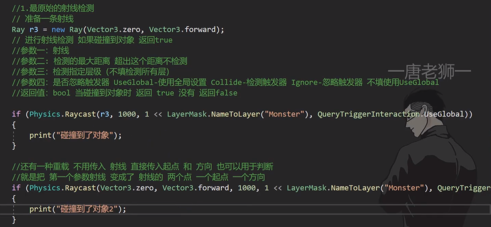
2.获取相交的单个物体的信息
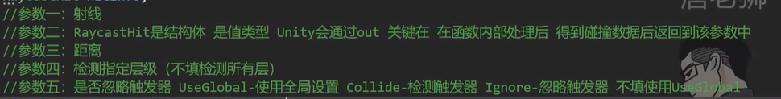

```c#
RaycastHit hitInfo;
if(Physics.Raycast(r,out hitInfo,1000,1<<LayerMask.NameToLayer("Monster"),QueryTriggerInteraction.UseGlobal))
{
    //碰撞器信息
    hitInfo.collider;
    //碰撞到的点
    hitInfo.point;
    //法线信息
    hitInfo.normal;
    //得到碰撞对象的位置
    hitInfo.transform.position;
    //得到碰撞对象离自己的距离
    hitInfo.distance;  
}
//return bool
//也有一种重载，不用传入射线，直接传入起点和方向

```

3.获取相交的多个物体的信息
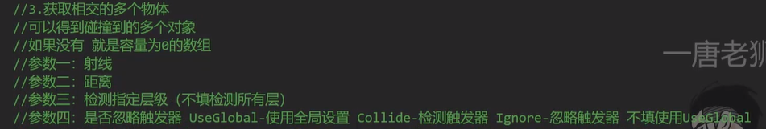

```c#
RaycastHit[] hits=Physices.RaycastAll(r,1000,1<<LayerMask.NameToLayer("Monster"),QueryTriggerInteraction.UseGlobal);
//先进来的在数组后面，后进来的在前面
//还有一种重载，不用传入射线，直接传入起点和方向
```

4.返回碰撞的数量，用过out得到数据

```c#
hits=Physics.RaycastNonAlloc(r,hits,......);
```


#### 使用时应注意的问题

距离，层级两个参数都是int类型，不要弄混

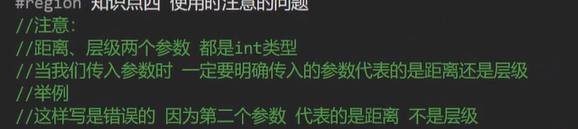
