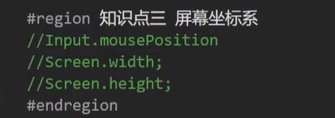
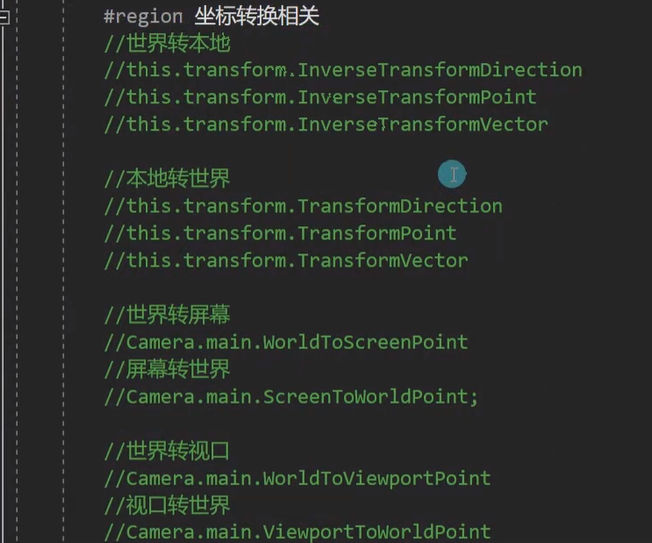
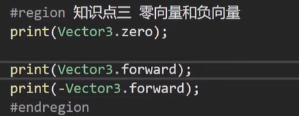
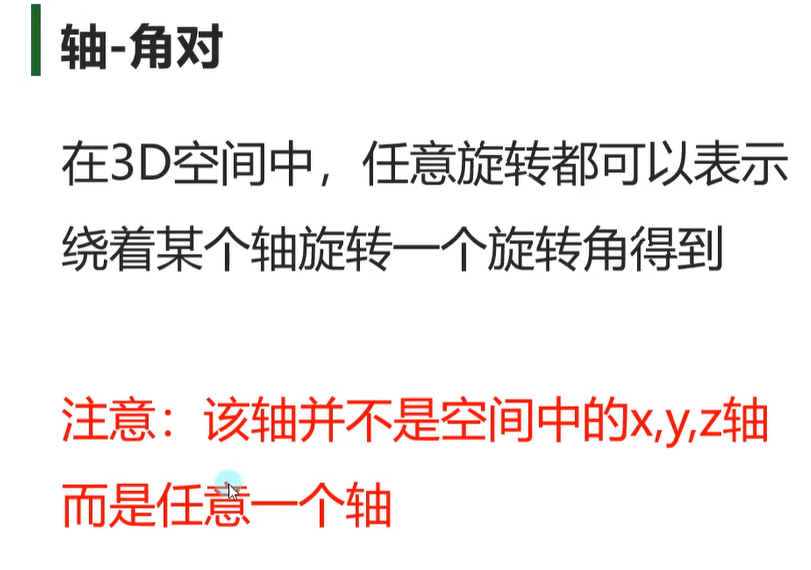
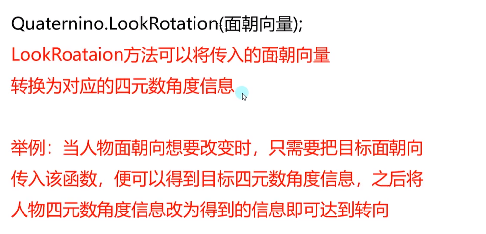
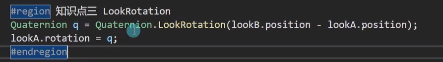
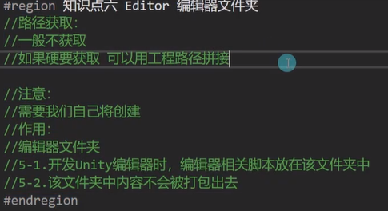

# Unity基础

---

## 3D数学

### MathF

#### MathF和Math


#### MathF中的常用方法

```c#
Mathf.PI
```

```c#
Mathf.Abs(num)
```

```c#
Mathf.CeilToInt(1.3)//向上取整，强转向下取整
```

```c#
Mathf.FloorToInt(1.6)//向下取整
```

```c#
Mathf.Clamp(num,min,max)//比max大取max，比min小取min，在中间取自己
```

```c#
Mathf.Max(1,2,3)//获取最大值
```

```c#
Mathf.Min(1,2,3)//获取最小值
```

```c#
Mathf.Pow(num,n)//一个数的n次幂
```

```c#
Mathf.RoundToInt(num)//四舍五入
```

```c#
Mathf.Sqrt(num)//返回一个数的平方根
```

```c#
Mathf.IsPowerOfTwo(num)//判断是否是2的n次方 return bool
```

```c#
Mathf.Sign(num)//判断正负数 return float,正数为1，负数为-1，0看做正数
```

#### 插值运算 - Lerp

```c#
result=Mathf.Lerp(start,end,t);
```


### 三角函数

#### 角度和弧度


#### 弧度角度相互转换

```c#
Mathf.Rad2Deg//弧度转角度
```

```c#
Mathf.Deg2Rad//角度转弧度
```


#### 三角函数

```c#
Mathf.Sin(rad)//传入的参数需要是弧度值
Mathf.Cos(rad)
```

#### 反三角函数

反三角函数得到的结果是正弦或者余弦值对应的弧度

```c#
Mathf.Asin()
Mathf.Acos()
```

### 坐标系

#### 世界坐标系


#### 物体坐标系


#### 屏幕坐标系




#### 视口坐标系

摄像机上的视口范围


#### 坐标转换




### 向量

#### 向量基础


#### 两点决定一向量


#### 零向量和负向量




#### 向量的模长


```c#
Vector3 a=new Vector3(1,1,1);
a.magnitude//获取向量模长的成员属性
```


#### 单位向量


#### 向量加减乘除

##### 加法


##### 减法


##### 乘除法


#### 向量点乘


##### 补充知识 调试画线


##### 通过点乘判断对象方位

```c#
Vector3.Dot(Vector3 a,Vector3 b)
```


##### 通过点乘推导公式算出夹角


##### 通过API计算夹角

```c#
Vector3.Angle(Vector3 a,Vector3 b)
```


#### 向量叉乘

##### 叉乘计算


```c#
Vector3.Cross(a.position,b.position)
```

##### 叉乘几何意义


```
AxB=|A|*|B|*sinθ
```

#### 向量插值运算

##### 线性插值


##### 球形插值


### Quaternion四元数

#### 为何使用四元数

##### 欧拉角


##### 万向节死锁


#### 四元数是什么

##### 四元数构成


##### 轴角对




##### 在unity中初始化


```c#
Quaternion.AngleAxis(角度，轴)
```

##### 四元数和欧拉角的相互转换


##### 四元数弥补的欧拉角缺点

四元数旋转后，转换后的欧拉角始终是-180~180°

四元数相乘代表旋转四元数


此处的vector3.up不是世界坐标系的，是物体自己坐标系的

#### 四元数常用方法

##### 单位四元数


```c#
Quaternion.identity
```

##### 插值运算


##### 向量指向转四元数



 

#### 四元数计算

##### 四元数相乘


##### 四元数乘向量


一定是四元数在前，向量在后，否则报错

##### unity绕轴旋转方向如何确定


## Mono中的重要内容

### 延迟（延时）函数

#### 什么是延迟函数


#### 延迟函数的使用


1-2是指延时函数只能调用无参函数，想调用有参函数，可将有参函数包裹在无参函数里

1-3指的是想要调用别的脚本上的函数，也将其包裹在本脚本的一个无参函数中


取消延时函数


判断是否有延迟函数


#### 延迟函数受对象失活影响

脚本依附对象失活或者脚本自己失活，延迟函数可以继续执行（可利用生命周期函数管理）


脚本依附对象销毁或者脚本移除，延迟函数无法继续执行

### 协同程序

##### Unity支持多线程

Unity新开线程无法直接访问Unity相关对象的内容
unity线程记得关闭，不然和unity编辑器共生

##### 协同程序是什么

“假”的多线程
主要作用：将代码分时执行，不卡主线程
主要使用场景：异步下载文件，异步加载文件，场景异步创建，批量创建时防止卡顿

##### 协同程序和线程的区别

新开一个线程是独立的一个管道，和主线程并行执行
新开一个协程是在原线程上开启，进行逻辑分时分步执行

##### 协程的使用

继承MonoBehavior的类都能开启协程函数

第一步：申明协程函数

- 协程函数返回值必须是IEnumerator或者是继承他的类型
- 协程函数必须使用yield return进行返回

第二步：开启协程函数
	协程函数不能直接像函数一样去调用

常用开启方式
- StartCoroutine(MyCoroutine())
- IEnumerator ie=MyCoroutine()
  StartCoroutine(ie)

第三步：退出协程函数
	关闭所有协程：`StopAllCoroutines()`
	关闭指定协程：

```c#
Coroutine c=StartCoroutinr(MyCoroutine());
StopCoroutine(c);
```

##### yield return 不同内容的含义

1. 下一帧执行

   - yield return 数字
   - yield return null

   在Update和LateUpdate之间执行

2. 等待指定秒后执行

   - yield return new WaitForSecond(秒)

   在Update和LateUpdate之间执行

3. 等待下一个固定物理帧更新时执行

   - yield return new WaitForFixedUpdate();

   在FixedUpdate和碰撞检测相关函数之后执行

4. 等待摄像机和GUI渲染完成后执行

   - yield return new WaitForEndOfFrame();//一般用于截图功能

   在LateUpdate之后的渲染相关处理完毕后执行

5. 一些特殊类型的对象，比如异步加载相关函数返回的对象，之后讲解，一般在Update和LateUpdate之间执行

6. 跳出协程
   yield break；

##### 协程受对象和组件失活销毁的影响

协程开启后，组件和物体销毁，协程不执行；物体失活协程不执行，组件（脚本）失活协程执行

#### 协程原理

##### 协程的本质


##### 协程本体是迭代器方法的体现


##### 协程调度器


## Resources资源动态加载

### Unity中的特殊文件夹

#### 工程路径获取

```c#
Application.dataPath//该方式获取到的路径一般情况下只在编辑模式下使用，在游戏实际发布后，不会使用该路径，因为游戏发布过后，该路径就不存在了
```

#### Resources资源文件夹

手动创建这个文件夹，且名字不要拼错
获取：

```c#
Application.dataPath + "/Resources" //一般不进行路径获取，只能使用Resources相关API进行加载，如果硬要获取，可以用工程路径拼接
```

注意：


#### StreamingAssets 流动资源文件夹

路径获取：
```c#
Application.streamingAssetsPath//不能通过dataPath去拼接获取
```

注意：


#### persistentDataPath 持久数据文件夹

路径获取：
```c#
Application.persistentDataPath
```

注意：


#### Plugins 插件文件夹


#### Editor 编辑器文件夹



#### Standard Assets 默认资源文件夹


### Resources同步加载

#### Resurces资源动态加载的作用


#### 常用资源类型


#### 资源同步加载 普通方法

```c#
Resources.Load("路径+name");//return Object
```

预设体资源


音效资源


文本资源


图片


其他类型


问题：资源同名怎么办


#### 资源同步加载 泛型方法


### Resources异步加载

#### Resources异步加载是什么


#### Resources异步加载方法

异步加载不能马上得到加载的资源，至少等一帧

1.通过异步加载中的完成事件监听，使用加载的资源

```c#
ResourceRequest rq=Resources.LoadAsync<T>(string path)
rq.completed += LoadOver;
private void LoadOver(AsyncOperation rq)
{
    //资源加载结束之后逻辑
    print("加载结束");
    (rq as ResourceRequest).asset//return object,asset是资源对象
}
```


2.通过协程使用加载的资源


总结


###  Resources卸载资源

#### Resources重复加载资源会浪费内存吗


#### 如何手动释放缓存中的资源


## 场景异步切换

