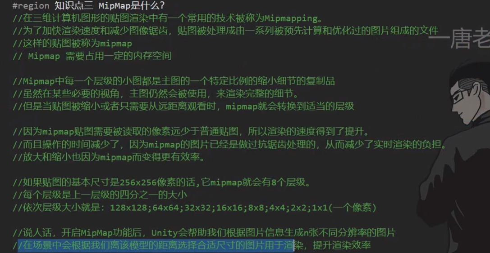

# Unity核心

### 认识模型的制作过程

> **建模**

> **展UV**

> **材质和纹理贴图**

> **骨骼绑定**

> **动画制作**

### 2D相关

#### 图片导入相关设置

##### 图片导入概述

> **Unity支持的图片格式**

> **图片设置的6大部分**

##### 参数设置-纹理类型设置

> **纹理类型主要是设置什么**

设置纹理类型主要是为了让纹理图片有不同的用途，指明其是用于哪项工作的纹理

> **参数讲解**

- Default：默认纹理
  
  
- Normal map:法线贴图格式
  
- Editor GUI and Legacy GUI
  一般在编辑器中或者GUI上使用的纹理
- Sprite（2D and UI）
  2D游戏或者UGUI中使用的格式
  
  
- Cursor
  自定义光标
- Cookie
  光源剪影格式
  
- Lightmap
  光照贴图格式
- Single Channel
  纹理只需要单通道的格式
  

##### 参数设置-纹理形状

> **纹理形状主要是设置什么？**

> **参数设置**

##### 参数设置-高级设置

> **高级设置是设置什么**

主要是纹理的一些尺寸规则，读写规则，以及MipMap相关设置

> **参数讲解**

> **MipMap是什么**

##### 参数设置-平铺拉伸

> **平铺拉伸主要做什么**

字面意思，设置图片的平铺规则和拉伸规则

> **参数设置**

##### 参数设置-平台设置（非常重要）

> **平台设置主要设置什么**

平台设置主要设置纹理最终打包时在不同平台的尺寸，格式，压缩方式
非常重要，因为它影响了包大小和读取性能方面的问题

> **参数相关**

**都支持的格式：**

**移动端和网页端独有的格式：**

**根据不同平台单独进行设置：**

#### Sprite

##### Sprite Editor

###### Single图片编辑

> **Sprite Editor是什么**

> **安装2D Sprite**

如果是3D项目，在Window-Package Manager下安装，2D项目会自动安装

> **Sprite Editor图片编辑 功能讲解**

Spritor Editor:

Custom Outline,Custom Physics Shape:

Skinning Editor:
有骨骼才能使用

Secondary Texture：

###### Multiple图集元素分割

> **Multiple是什么**

> **参数讲解**

slice模式：

Trim是用来修剪图片的，去掉空白区域

###### Polygon多边形编辑

sides:3~128
会根据边界自动确定渲染范围，后续如果改成single记得改渲染范围

##### Sprite Render精灵渲染器

> **Sprite Render是什么**

> **2D对象创建**

1.直接拖入Sprite图片

2.右键创建

3.空物体添加脚本

> **参数讲解**

> **代码设置**

其他属性直接 **.** 出来用就可以