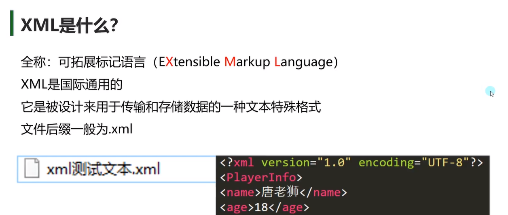

# 数据持久化——XML

## 概括

> XML是什么？



> 一般使用XML文件来记录和传输数据


## XML文件格式

### XML基本语法

> 创建XML文件


> 注释

```xml
<!--注释内容-->
```

> 固定内容

```xml
<?xml version="1.0" encoding="UTF-8"?>
<!--放在第一行,用于Unity读取数据文件-->
<!--version代表版本 encoding代表编码格式
不同编码格式中的字符对应的二进制是不一样的
乱码出现的情况就是因为用了不一样的编码格式去解析文本内容，由于字符和对应的二进制不匹配，就会出现乱码
-->
```

> 基本语法

```xml
<!--固定语法-->
<元素标签></元素标签>
```

```xml
<!--必须有一个根节点-->
<PlayerInfo>
    <name>by1</name>
    <sex></sex>
    <ItemList>
        <Item>
            <id>1</id>
            <num>1</num>
        </Item>
        <Item></Item>
    </ItemList>
</PlayerInfo>
```

> 基本规则


### XML属性

> 属性语法


```xml
<!--必须有一个根节点-->
<PlayerInfo>
    <name>by1</name>
    <sex></sex>
    <ItemList>
        <Item id="1" num="1">
        </Item>
        <Item id="2" num="2"/>
    </ItemList>
</PlayerInfo>
```

> 属性和元素节点的区别

只是写法上的区别而已，可以选择自己喜欢的方式来记录数据


> 如何查语法错误

1.元素标签必须配对

2.属性必须有引号

3.注意命名

4.到在线网站上使用XML验证器验证

## C#读取存储XML

### XML文件存放位置

> 只读不写的XML文件
可以放在`Resources`或者`StreamingAssets`文件夹下

> 动态存储的XML文件

放在`Application.persistentDtaPath`路径下

### 读取XML文件

> 1.XmlDocument

把数据加载到内存中，方便读取


**1.读取xml文件信息**

```c#
XmlDocument xml = new XmlDocument();
//存放在Resources文件夹下的xml文件加载处理
TextAsset asset=Resource.Load<TextAsset>("TestXml");
print(asset.text);
//1.直接根据xml字符串内容来加载xml文件
xml.LoadXml(asset.text);
//2.通过xml文件的路径去进行加载
xml.Load(Application.streamingAssetsPath + "/TestXml.xml");
```

**2.读取元素和属性信息**

```c#
//节点信息类
//XmlNode单个节点信息类
//节点列表信息
//XmlNodeList多个节点信息类

//获取xml当中的根节点
XmlNode root = xml.SelectSingleNode("Root");
//在通过根节点去获取下面的子节点
XmlNode node=root.SelectSingleNode("name");
//如果想要获取节点包裹的元素信息，直接 .InnerText
print(node.InnerText);
//得属性
XmlNode nodeItem=root.SelectSingleNode("Item");
//第一种方式直接中括号获取信息
print(nodeItem.Attributes["id"].Value);
//第二种放肆
print(nodeItem.Attributes.GetNameItem("id").Value);

//如果有同名的子节点，用XmlNodeList
XmlNodeList friendList=root.SelectNodes("Friend");
//遍历方式一：迭代器遍历
foreach(XmlNode item in friendList)
{
    print(item.SelectSingleNode("name").InnerText);
}
//遍历方式二：通过for循环遍历
for(int i=0;i<friendList.Count;i++)
{
    print(friendList[i].SelectSingleNode("name").InnerText);
}
```

**3.总结**


> 2.XmlTextReader

以流形式加载，内存占用更少，但是是单向只读，使用不是特别方便，除非有特殊需求，否则不会使用

>3.Linq

以后讲

### 存储修改XML文件

> 1.决定存储在哪个文件夹下

存储xml文件，在Unity中一定是使用各平台都可读可写可找到的


```c#
string path=Application.persistentDataPath+"/PlayerInfo.xml";
```


> 2.存储xml文件

**关键类：**
XmlDocument 用于创建节点 存储文件
XmlDeclaration 用于添加版本信息
XmlElement 节点类

```c#
//存储有五步
//1.创建文本对象
XmlDocument xml=new XmlDocument();

//2.添加固定版本信息
XmlDeclaration xmlDec=xml.CreateXmlDeclaration("1.0","UTF-8","");
xml.AppendChild(xmlDec);

//3.添加根节点
XmlElement root=xml.CreateElement("Root");
xml.AppendChild(root);

//4.为根节点添加子节点
XmlElement name=xml.CreateElement("Name");
name.InnerText="by1";
root.AppendChild(name);

XmlElement atk=xml.CreateElement("atk");
atk.InnerText="10";
root.AppendChild(atk);
	//添加属性
XmlElement childNode=xml.CreateElement("Item")''
childNode.SetAttritube("id",i.ToString());

//5.保存
xml.Save(path);
```


> 3.修改xml文件

1.先判断文件是否存在

```c#
if(File.Exists(path))
{
    
}
```

2.加载文件后，直接添加节点，移除节点即可

```c#
XmlDocument xml=new XmlDocument();
xml.Load(path);
XmlNode node=xml.SelectSingleNode("Root").SelectSingleNode("name");
XmlNode node1=xml.SelectSingleNode("Root/name");
//得到父节点
XmlNode root=xml.SelectSingleNode("Root");
//移除子节点
root.RemoveChild(node);
//添加子节点
XmlElement speed=xml.CreateElement("moveSpeed");
speed.InnerText="2.5";
root.AppendChild(speed);
//改了记得存
xml.Save(path);
```

> 4.总结


## 必备知识点

### XML序列化

> 什么是序列化和反序列化

序列化：把对象转化为可传输的字节序列过程成为序列化
反序列化：把字节序列还原为对象的过程称为反序列化

> XML序列化

```C#
//1.准备一个数据结构类
public class Test
{
    public int testPublic=10;
    private int testPrivate=11;
    protected int testProtected=12;
    internal int testInternal=13;
    public string testPublicStr="123";
    public int testPro{get;set;}
    public Test2 testClass=new Test2();
}
public class Test2
{
    public int test1=1;
    public float test2=1.1f;
    public bool test3=true;
}
//
Test t=new Test();
//2.进行序列化

//第一步，确定存储路径
string path=Application.persistentDataPath+"/Test.xml";
//第二步，结合using知识点和StreamWriter这个流对象来写入文件
//括号内的代码：写入一个文件流，如果有该文件，直接打开并修改，如果没有该文件，直接新建一个文件
//using新用法：括号当中包裹的声明的对象会在大括号语句块结束后自动释放掉
//当语句块结束，会自动帮我们调用对象（继承了Dipose接口）的Dispose方法，让其进行销毁
//using一般都是配合内存占用比较大或者有读写操作时进行使用的
using(StreamWriter stream=new StreamWriter(path))
{
    //第三步，进行xml文件序列化
    XmlSerializer s=new XmlSerializer(typeof(Test));
 //这句代码的含义就是通过序列化对象对我们的类对象进行翻译，将其翻译成我们的xml文件，写入到对应的文件夹中
//第一个参数：文件流对象
//第二个参数：想要翻译的对象

    s.Serialize(stream,t);
}
//这种序列化方式不支持字典
```

> 自定义节点名 或 设置属性

```C#
//在数据处添加特性
[XmlAttritube("name")];
//只是想改名字
[XmlElement("name")];
//改变数组名字
[XmlArray("name")]
//改变数组内部元素名字
[XmlArrayItem("name")];
```

> 总结


### XML反序列化

> 判断文件是否存在

```C#
string path=Application.persistentDataPath+"/Test.xml";
if(File.Exists(path))
{
    
}
```


> 反序列化

```C#
using(StreamReader reader=new StreamReader())
{
    //产生了一个序列化反序列化翻译机器
    XmlSerializer s=new XmlSerializer(typeof(Test));
    Test test=s.Deserialize(reader)as Test;
}
//如果类里面的List进行了初始化，反序列化时不会覆盖原数据，会在其初始化值之后添加值
```

### Ixmlserializable接口

> **Ixmlserializable是什么**


> **自定义类实践**

```c#
public class Test:IXmlSeializable
{
    public int test1;
//引用类型默认值为空，那么xml文件里是看不到该字段的
    public string test2;
    public XmlSchema GetSchema()
    {
        return null;
    }
    //反序列化时会自动调用的方法
    public void ReadXml(XmlReader reader)
    {
        //在里面可以定义反序列化的规则
        //1.读属性
        this.test1=int.Parse(reader["test1"]);
        this.test2=reader["test2"];
        //2.读节点方式一
        reader.Read();//这时是读到的test1节点
        reader.Read();//读到test1节点包裹的内容
        this.test1=reader.Value;//得到当前内容的值
        reader.Read();//读到尾部包裹节点
        //读节点方式二
        while(reader.Read())
        {
            if(reader.NodeType==XmlNodeType.Element)
            {
                switch(reader.Name)
                {
                    case "test1":
       					reader.Read();
                   	this.test1=int.Parse(reader.Value);
                        break;
                    case "test2":
                        reader.Read();
                        this.test2=reader.Value;
                        break;
                }
            }
        }
        //3.读包裹节点
                XmlSerializer s=new XmlSerializer(typeof(int));
        //跳过根节点
        reader.Read();
        
        reader.ReadStartElement("test1");
        test1=(int)s.Deserialize(reader);
        reader.ReadEndElement();
    }
    //序列化时会自动调用的方法
	public void WriteXml(XmlWriter writer)
    {
        //在里面可以自定义序列化的规则
        //如果要自定义序列化的规则，一定会用到XmlWriter中的一些方法来进行序列化
        //1.写属性
     writer.WriteAttritubeString("test1",this.test1.ToString());
        writer.WriteAttritubeString("test2",this.test2);
        //2.写节点
        writer.WriteElementString("test1",this.test1.ToString());
        writer.WriteElementString("test2",this.test2);
        //3.写包裹节点
        XmlSerializer s=new XmlSerializer(typeof(int));
        writer.WriteStartElement("test1");
        s.Serialize(writer,test1);
        writer.WriteEndElement();
        
                XmlSerializer s=new XmlSerializer(typeof(string));
        writer.WriteStartElement("test2");
        s.Serialize(writer,test2);
        writer.WriteEndElement();
    }
}
Test t=new Test();
string path=Application.persistentDataPath+"/test.xml";
using (StreamWriter writer=new StreamWriter(path))
{
    XmlSerializer s=new XmlSerializer(typeof(Test));
    s.Serialize(writer,t);
}
using(StreamReader resder=new StreamReader(path))
{
    XmlSerializer s=new XmlSerializer(typeof(Test));
    Test t2=s.Deserialize(reader)as Test;
}
```

### 让Dictionary支持XML序列化和反序列化

> 1.思考如何让Dictionary支持xml序列化和反序列化

我们没办法修改c#自带的类，但可以新建一个类让其继承Dictionary和IxmlSerializable接口
```c#
public class SerializerDictionary<TKey,TValue>:Dictionary<TKey,TValue>,IxmlSerializable
{
    public XmlSchema GetSchema()
    {
        return null;
    }
    public void ReadXml(XmlReader reader)
    {
                XmlSerializer keySer=new XmlSerializer(typeof(TKey));
                XmlSerializer valueSer=new XmlSerializer(typeof(TValue));
        //跳过根节点
        reader.Read();
        while(reader.NodeType!=XmlNodeType.EndElement)
        {
            TKey key=(Tkey)keySer.Deserialize(reader);
            TValue value=(TValue)valueSer.Deserialize(reader);
            this.Add(key,value);
        }
        //读取结束节点
        reader.Read();
    }
    public void WriteXml(XmlWriter writer)
    {
        XmlSerializer keySer=new XmlSerializer(typeof(TKey));
        XmlSerializer valueSer=new XmlSerializer(typeof(TValue));
        foreach(KeyValuePair<TKey,TValue>kv in this)
        {
            keySer.Serialize(writer,kv.key);
            valueSer.Serialize(writer,kv.value);
        }
    }
}
```

