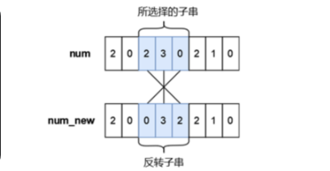

# 63\. 更小的数

###### 题目描述

小蓝有一个长度均为 n 且仅由数字字符 0 - 9 组成的字符串，下标从 0 到 n - 1，你可以将其视作是一个具有 n 位的十进制数字 num，小蓝可以从 num 中选出一段连续的子串并将子串进行反转，最多反转一次。 

小蓝想要将选出的子串进行反转后再放入原位置处得到的新的数字 numnew 满足条件 numnew < num，请你帮他计算下一共有多少种不同的子串选择方案，只要两个子串在 num 中的位置不完全相同我们就视作是不同的方案。

注意，我们允许前导零的存在，即数字的最高位可以是 0，这是合法的。

  

###### 输入描述

输入一行包含一个长度为 n 的字符串表示 num（仅包含数字字符 0 ∼ 9），从左至右下标依次为 0 ∼ n − 1。

###### 输出描述

输出一行包含一个整数表示答案。

###### 输入示例

```
210102
```

###### 输出示例

```
8
```

###### 提示信息

一共有 8 种不同的方案：

1\. 所选择的子串的下标为 0 \~ 1，反转后的numnew = 120102 < 210102

2\. 所选择的子串的下标为 0 \~ 2，反转后的numnew = 012102 < 210102

3\. 所选择的子串的下标为 0 \~ 3，反转后的numnew = 101202 < 210102

4\. 所选择的子串的下标为 0 \~ 4，反转后的numnew = 010122 < 210102

5\. 所选择的子串的下标为 0 \~ 5，反转后的numnew = 201012 < 210102

6\. 所选择的子串的下标为 1 \~ 2，反转后的numnew = 201102 < 210102

7\. 所选择的子串的下标为 1 \~ 4，反转后的numnew = 201012 < 210102

8\. 所选择的子串的下标为 3 \~ 4，反转后的numnew = 210012 < 210102

数据范围：
1 <= 字符串长度 <= 10

## 暴力枚举

```c++
#include<bits/stdc++.h>
using namespace std;
int main()
{
    string num;
    cin>>num;
    int ans=0;
    for(int i=0;i<num.size();i++)
    {
        for(int j=i+1;j<num.size();j++)
        {
        	string sub=num.substr(i,j-i+1);
        	int pre=stoi(sub);
        	reverse(sub.begin(),sub.end());
        	int next=stoi(sub);
            if(pre>next)
            {
                ans++;
            }
            reverse(sub.begin(),sub.end());
        }
    }
    cout<<ans<<endl;
    return 0;
}
```

## 暴力枚举优化

### 优化思路

1. **比较字符**：在反转子串之前，可以先比较子串的首尾字符，如果首字符已经小于尾字符，反转后整个字符串肯定会变大，因此可以跳过这些子串。
2. **提前终止**：如果在比较过程中发现子串的某个位置已经决定了反转后的结果，可以提前终止比较。

```c++
#include<bits/stdc++.h>
using namespace std;

int main() {
    string num;
    cin >> num;
    int n = num.size();
    int ans = 0;

    for (int i = 0; i < n; i++) {
        for (int j = i + 1; j < n; j++) {
            if (num[i] > num[j]) {
                ans++;
            } else if (num[i] == num[j]) {
                int left = i + 1, right = j - 1;
                while (left < right) {
                    if (num[left] > num[right]) {
                        ans++;
                        break;
                    } else if (num[left] < num[right]) {
                        break;
                    }
                    left++;
                    right--;
                }
            }
        }
    }

    cout << ans << endl;
    return 0;
}
```

### 复杂度分析

- **时间复杂度**：最坏情况下，时间复杂度仍然是 O(n^2)，但在实际应用中，由于提前终止比较，平均复杂度会有所降低。
- **空间复杂度**：O(1)，只使用了常数级别的额外空间。

## 动态规划

### 动态规划思路

1. **定义状态**：
   - 设 `dp[i][j]` 表示子串 `num[i...j]` 反转后是否满足 `numnew < num`。
   - 如果 `dp[i][j] = true`，则表示反转子串 `num[i...j]` 后，整个字符串会变小。
2. **状态转移**：
   - 如果 `num[i] > num[j]`，则反转子串 `num[i...j]` 后，整个字符串一定会变小，因此 `dp[i][j] = true`。
   - 如果 `num[i] == num[j]`，则需要比较子串 `num[i+1...j-1]` 是否满足条件，即 `dp[i+1][j-1]`。
   - 如果 `num[i] < num[j]`，则反转子串 `num[i...j]` 后，整个字符串会变大，因此 `dp[i][j] = false`。
3. **初始化**：
   - 对于长度为 1 的子串（即 `i == j`），反转后字符串不变，因此 `dp[i][j] = false`。
   - 对于长度为 2 的子串（即 `j = i+1`），直接比较 `num[i]` 和 `num[j]`。
4. **结果计算**：
   - 遍历所有子串 `num[i...j]`，统计满足 `dp[i][j] = true` 的数量
5. **遍历顺序**
	- 倒序遍历
```c++
#include<bits/stdc++.h>
using namespace std;

int main() {
    string num;
    cin >> num;
    int n = num.size();
    int ans = 0;

    // DP 表，初始化为 false
    vector<vector<bool>> dp(n, vector<bool>(n, false));

    // 从后往前遍历起始位置 i
    for (int i = n - 1; i >= 0; i--) {
        for (int j = i + 1; j < n; j++) {
            if (num[i] > num[j]) {
                dp[i][j] = true;
            } else if (num[i] == num[j]) {
                if (j - i > 1) { // 子串长度大于 2
                    dp[i][j] = dp[i + 1][j - 1];
                } else {
                    dp[i][j] = false; // 子串长度为 2 且相等，反转后不变
                }
            } else {
                dp[i][j] = false;
            }

            if (dp[i][j]) {
                ans++;
            }
        }
    }

    cout << ans << endl;
    return 0;
}
```

